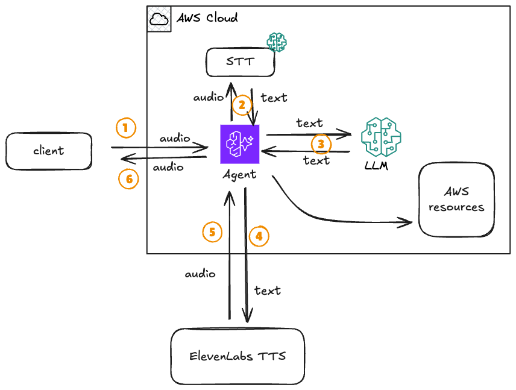
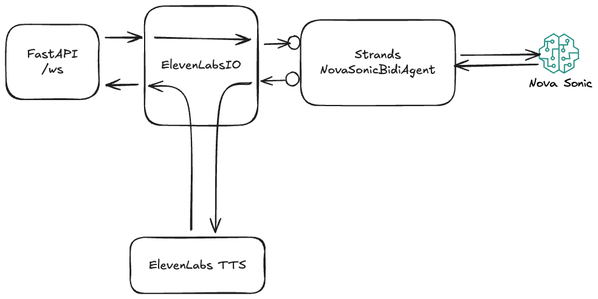

# Conversational Agent with Nova Sonic and ElevenLabs Voices

## Overview

In this example, we demonstrate how to create a conversational agent that leverages the deep customization achievable with ElevenLabs voices while maintaining a smooth interactive experience with the speaker.

## The Challenge

A typical approach to creating conversational bots uses a speech-to-text engine (STT), an LLM to generate output text, and a text-to-speech (TTS) engine to generate audio output. While this pipeline works fine, it can introduce noticeable latency when the LLM is replaced by a more complex agent that might use tools and require several loops before returning control to the user.

<div align="center">
  
  <p><i>Traditional STT → LLM → TTS Pipeline</i></p>
</div>

## The Solution

Speech-to-speech LLMs like **Amazon Nova Sonic** have been designed to optimally handle such use cases and run tools in parallel with output generation so that the conversation remains natural and fluid.

One drawback of this approach is the limited selection of voices that such models support, which is far from the rich catalog and customization options offered by niche players like **ElevenLabs**.

In this example, we combine the best of both worlds by using **Nova Sonic** as the conversational agent and **ElevenLabs** as the TTS engine.

### How It Works

The key insight is to use Nova Sonic to interpret user input and use the textual output to generate audio. Nova Sonic generates both text and corresponding audio, but we simply discard the audio while still benefiting from Nova Sonic's agentic capabilities, tool execution, user activity detection, and interrupts.

<div align="center">
  
  <p><i>Nova Sonic + ElevenLabs Integration Architecture</i></p>
</div>

## Architecture

The solution consists of:

1. **WebSocket Server** ([server.py](server.py)) - FastAPI application handling bidirectional audio streaming
2. **Audio I/O Integration** ([elevenlabs_io.py](elevenlabs_io.py)) - Custom implementation bridging Nova Sonic and ElevenLabs
3. **React Client** ([client/](client/)) - Web-based UI for testing the conversational agent

### Key Components

- **Nova Sonic**: Handles speech-to-text, agentic behavior, and tool execution
- **ElevenLabs**: Provides high-quality, customizable text-to-speech output
- **Strands BidiAgent**: Framework for building bidirectional conversational agents
- **Amazon Bedrock AgentCore Runtime**: Scalable, secure hosting for the agent

## Getting Started

For a complete walkthrough with deployment instructions, **see the [elevenlabs.ipynb](elevenlabs.ipynb) notebook**.

### Quick Start (Local Testing)

#### Prerequisites

> **⚠️ Note**: This example cannot be run on a cloud notebook and requires local setup.

1. **ElevenLabs Account**
   - Create an account at [ElevenLabs](https://elevenlabs.io)
   - Navigate to Developer → API Keys
   - Create an API key with text-to-speech permissions
   - Note down your API key

2. **AWS Credentials**
   - Configure AWS credentials with `AmazonBedrockFullAccess` policy
   - Ensure access to Amazon Nova Sonic model in your AWS region

3. **Environment Setup**
   ```bash
   cp .env.template .env
   ```

   Edit `.env` and add:
   - `ELEVENLABS_API_KEY` - Your ElevenLabs API key
   - `ELEVENLABS_VOICE_ID` - Voice ID (optional, defaults to Rachel voice)
   - AWS credentials (if testing locally)

#### Build and Run Locally

1. **Build the container**
   ```bash
   docker build -t nova-elevenlabs-agent . -f Dockerfile.original
   ```

2. **Run the container**
   ```bash
   docker run --env-file .env -p 8080:8080 nova-elevenlabs-agent
   ```

3. **Start the client application**
   ```bash
   cd client
   npm install
   npm run dev
   ```

4. **Test the agent**
   - Open your browser at `http://localhost:5173`
   - Enter `ws://localhost:8080/ws` as the WebSocket URL
   - Click **Start Connection**
   - Allow microphone access when prompted
   - Start talking to the agent!

You should hear the agent responding with the ElevenLabs voice you configured.

## Deploy to Amazon Bedrock AgentCore Runtime

For production deployment instructions, including:
- Pushing the container to Amazon ECR
- Configuring IAM authentication
- Deploying to AgentCore Runtime
- Generating presigned URLs for WebSocket connections

**Please refer to the [elevenlabs.ipynb](elevenlabs.ipynb) notebook** for step-by-step instructions.

## Project Structure

```
elevenlabs/
├── server.py                 # FastAPI WebSocket server
├── elevenlabs_io.py          # Nova Sonic + ElevenLabs integration
├── requirements.txt          # Python dependencies
├── Dockerfile.original       # Container configuration
├── .env.template            # Environment variables template
├── elevenlabs.ipynb         # Complete tutorial notebook
├── client/                  # React web client
│   ├── src/
│   ├── package.json
│   └── README.md
└── images/                  # Architecture diagrams
```

## Features

- ✅ Low-latency conversational AI with Nova Sonic
- ✅ High-quality, customizable voices from ElevenLabs
- ✅ Real-time bidirectional audio streaming
- ✅ Tool execution during conversation
- ✅ User interruption detection
- ✅ WebSocket-based architecture
- ✅ Deployable to Amazon Bedrock AgentCore Runtime

## Technical Details

### Audio Processing Flow

1. **Input**: Browser captures audio → WebSocket → Nova Sonic (STT)
2. **Processing**: Nova Sonic generates text response (with tool execution)
3. **Output**: Text → ElevenLabs (TTS) → WebSocket → Browser playback

### Audio Format

- **Sample Rate**: 16kHz
- **Format**: PCM (16-bit)
- **Channels**: Mono (1 channel)
- **Encoding**: Base64 over WebSocket

## Future Improvements

The current implementation is a demonstration and can be enhanced with:

- **Lazy audio rendering queue** to avoid unnecessary rendering when users interrupt
- **Audio playback interruption** when user activity is detected
- **Voice selection UI** for choosing different ElevenLabs voices
- **Improved error handling** and reconnection logic
- **Audio buffering** for smoother playback

## Learn More

- 📖 [Complete Tutorial (Notebook)](elevenlabs.ipynb) - Step-by-step guide with deployment
- 🔊 [ElevenLabs Documentation](https://elevenlabs.io/docs)
- 🤖 [Amazon Bedrock AgentCore](https://docs.aws.amazon.com/bedrock-agentcore/)
- 🎯 [Strands Agents](https://strandsagents.com/)

## Congratulations!

Through this sample, you learned how to:
- Implement a conversational agent using Strands `BidiAgent`
- Leverage Nova Sonic for low-latency conversational agentic behavior
- Integrate ElevenLabs for rich, customizable voice experiences
- Deploy to Amazon Bedrock AgentCore Runtime for scalable, secure hosting

**Ready to get started?** Open [elevenlabs.ipynb](elevenlabs.ipynb) and follow along! 🚀
