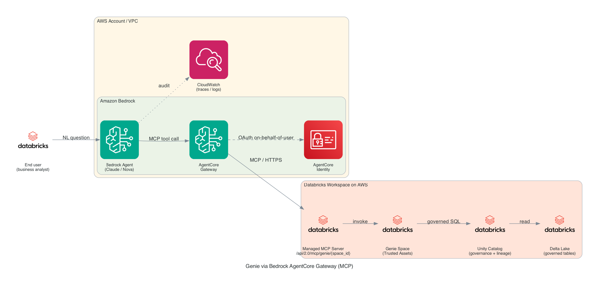

# Databricks Genie via Amazon Bedrock AgentCore Gateway (MCP)

Expose a [Databricks Genie](https://docs.databricks.com/en/genie/index.html) space as a governed MCP tool to Amazon Bedrock agents through [Amazon Bedrock AgentCore Gateway](https://docs.aws.amazon.com/bedrock-agentcore/latest/devguide/gateway.html). Bedrock agents ask plain-English business questions; Genie returns lakehouse-native SQL answers with Unity Catalog governance, identity, and lineage preserved end-to-end.

## Overview

This sample registers the [Databricks-managed Genie MCP endpoint](https://docs.databricks.com/en/generative-ai/mcp/managed-mcp.html) (`/api/2.0/mcp/genie/{space_id}`) as a target in Amazon Bedrock AgentCore Gateway. Once registered, any Bedrock agent associated with the gateway can call Genie as a tool — no custom NL-to-SQL chain, no data copy into Knowledge Bases, no parallel metric definitions. The gateway manages:

- **Inbound auth** — AgentCore Identity (optionally fronted by Amazon Cognito) authorizes agent → tool calls
- **Outbound auth** — Databricks OAuth2 M2M credentials, registered via `CreateOauth2CredentialProvider` and retrieved by Gateway at tool-invocation time
- **Audit** — Unity Catalog audit logs attribute SQL execution; CloudWatch captures the AgentCore tool-invocation trace

This sample complements the existing Databricks integrations in this folder:

- [`databricks-dbsql-agentcore-gateway`](../databricks-dbsql-agentcore-gateway) — Databricks SQL MCP with M2M auth
- [`databricks-dbsql-per-user-delegation`](../databricks-dbsql-per-user-delegation) — Per-user delegation via RFC 8693 token exchange

## Prerequisites

1. AWS credentials configured (`aws configure`) with permissions to create AgentCore resources and IAM roles, plus Bedrock foundation-model access in your region (Claude, Nova, or your preferred model)
2. Databricks workspace on AWS with Unity Catalog enabled and at least one [Genie Space](https://docs.databricks.com/en/genie/index.html) with Trusted Assets defined
3. Databricks service principal with an [OAuth M2M secret](https://docs.databricks.com/en/dev-tools/auth/oauth-m2m.html); the service principal needs `CAN RUN` on the Genie space and `USE CATALOG` / `USE SCHEMA` / `SELECT` on the tables behind it
4. Python 3.10+

## Getting Started

The notebook covers:

1. Configure Databricks + AWS credentials
2. Create (or reuse) an AgentCore Gateway with Cognito inbound auth
3. Register a Databricks OAuth2 credential provider for outbound auth via `CreateOauth2CredentialProvider`
4. Grant the gateway role the IAM permissions it needs to fetch tokens and read the stored secret
5. Add the Databricks Genie MCP endpoint as a Gateway target and synchronize tools
6. Attach the gateway to a Bedrock agent and run end-to-end with sample prompts
7. Validate governance via Unity Catalog audit logs and CloudWatch traces
8. Clean up — delete the target, credential provider, and gateway

## Resources

- [Databricks Genie](https://docs.databricks.com/en/genie/index.html)
- [Databricks managed MCP servers](https://docs.databricks.com/en/generative-ai/mcp/managed-mcp.html)
- [Databricks OAuth M2M authentication](https://docs.databricks.com/en/dev-tools/auth/oauth-m2m.html)
- [Amazon Bedrock AgentCore Gateway](https://docs.aws.amazon.com/bedrock-agentcore/latest/devguide/gateway.html)
- [Amazon Bedrock AgentCore Identity](https://docs.aws.amazon.com/bedrock-agentcore/latest/devguide/identity.html)
- [AgentCore Gateway tutorials](https://github.com/awslabs/agentcore-samples/tree/main/01-tutorials/02-AgentCore-gateway)
