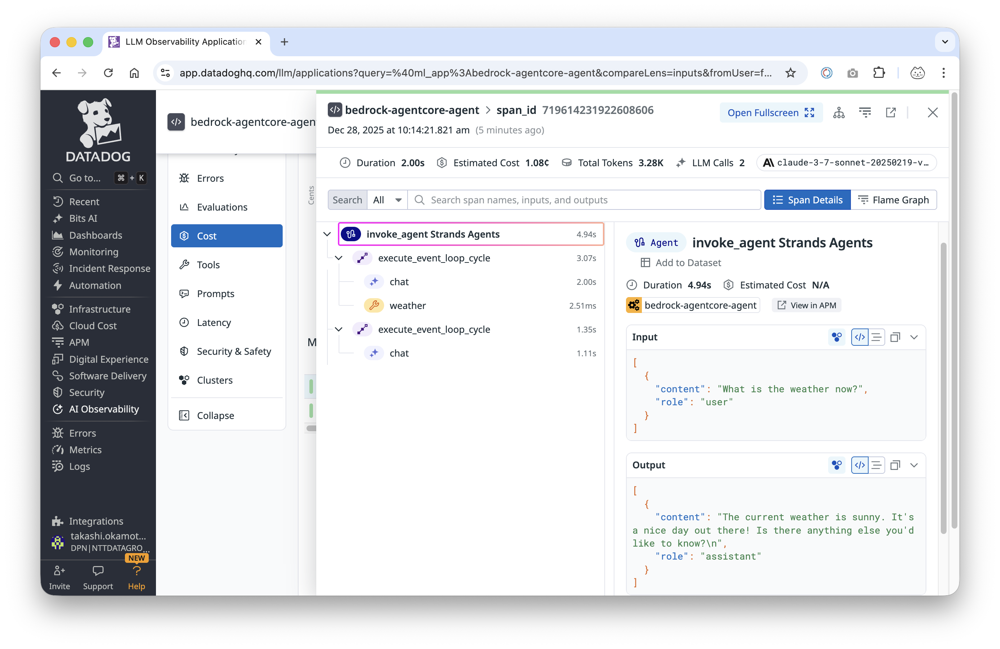
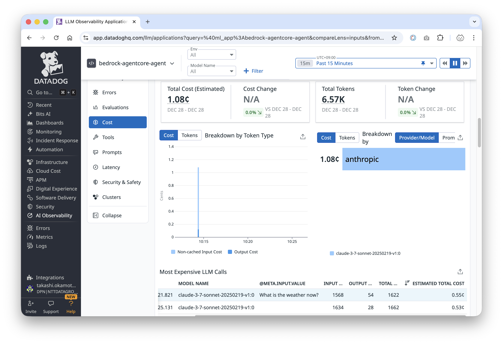
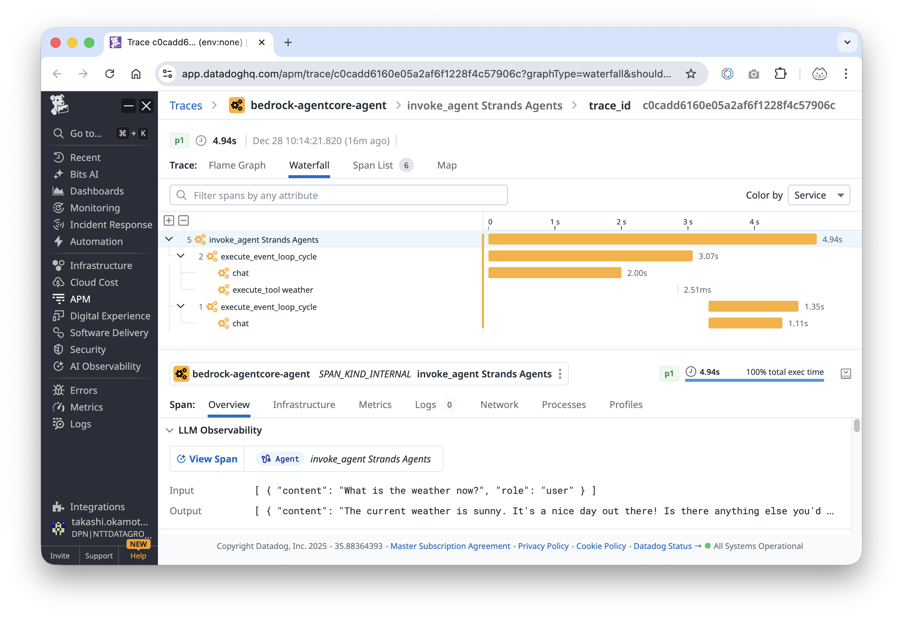

# Amazon Bedrock Agent Integration with Datadog LLM Observability

This example contains a demo of a Personal Assistant Agent built on top of [Bedrock AgentCore Agents](https://docs.aws.amazon.com/bedrock-agentcore/latest/devguide/what-is-bedrock-agentcore.html) with Datadog LLM Observability.

Bedrock AgentCore comes with [Observability](https://docs.aws.amazon.com/bedrock-agentcore/latest/devguide/observability.html) support out-of-the-box. Strands Agents can emit OpenTelemetry spans for key agent lifecycle operations (model inferences, tool calls, planner loops), and Datadog LLM Observability can ingest those spans via OTLP.

## Prerequisites

- Python 3.11 or higher
- Datadog account with LLM Observability enabled
- A Datadog API key (set as `DD_API_KEY`)
- AWS Account with appropriate permissions
- Access to the following AWS services:
   - Amazon Bedrock AgentCore

## Modify Strands Agent Code

The Strands Agents framework ships with auto-instrumentation. Add the following snippet at the beginning of your agent to initialize the OTLP exporter:

```python
from strands.telemetry.config import StrandsTelemetry

telemetry = StrandsTelemetry()
telemetry.setup_otlp_exporter()
```

## How to use

Ensure your account has access to the model `us.anthropic.claude-3-7-sonnet-20250219-v1:0` used in this example. Please refer to the
[Amazon Bedrock documentation](https://docs.aws.amazon.com/bedrock/latest/userguide/model-access-permissions.html) to see how to enable access to the model.
You can change the model used by configuring the environment variable `BEDROCK_MODEL_ID`.

## Run the app at local

Configure OTEL environment to send trace to Datadog.

```bash
export DD_API_KEY=[Datadog API Key]
export OTEL_EXPORTER_OTLP_ENDPOINT=https://trace.agent.datadoghq.com
export OTEL_SEMCONV_STABILITY_OPT_IN=gen_ai_latest_experimental
export OTEL_TRACES_EXPORTER=otlp
export OTEL_SERVICE_NAME=bedrock-agentcore-agent
export OTEL_EXPORTER_OTLP_TRACES_HEADERS="dd-api-key=${DD_API_KEY},dd-otlp-source=datadog" 
```

#### OTEL environment explanation

|env | description | sample |
|-----|--------------|--------|
|OTEL_EXPORTER_OTLP_ENDPOINT|OTEL endpoint for Datadog|https://trace.agent.datadoghq.com|
|OTEL_SEMCONV_STABILITY_OPT_IN|Flag for version of OTEL SemConv semantic |gen_ai_latest_experimental|
|OTEL_TRACES_EXPORTER||Exporter for OTEL | otlp|
|OTEL_SERVICE_NAME|Application/Service Name for Datadog LLM Observability/APM|bedrock-agentcore-agent|
|OTEL_EXPORTER_OTLP_TRACES_HEADERS|OTEL Headers|dd-api-key=[Datadog API KEY],dd-otlp-source=datadog|

After you set the environment variables, start the example with:

```bash
uv run travel-agent.py
```

This launches an HTTP server on port 8080 that exposes the /invocations endpoint required by AgentCore.


You can interact with your agent with the following command:

```bash
curl -X POST http://127.0.0.1:8080/invocations --data '{"prompt": "What is the weather now?"}'
```

## Datadog dashboard

After a few requests, you should see traces in Datadog under AI Observability / Traces, with the agent run, model spans, and tool calls connected in a single end-to-end trace.




NOTE: In Datadog, select the application or service whose name matches your `OTEL_SERVICE_NAME` value to see these traces.


### LLM Cost 
You can check cost for each agent invoke also can see summarized cost as well.




### APM Trace
For more detail such as timeline, you can check APM trace.




# Deploy on AgentCore Runtime
## Setting your AWS keys

Follow the [Amazon Bedrock AgentCore documentation](https://docs.aws.amazon.com/bedrock-agentcore/latest/devguide/runtime-permissions.html) to configure your AWS Role with the correct policies.
Afterwards, you can set your AWS keys in your environment variables by running the following command in your terminal:

```bash
export AWS_ACCESS_KEY_ID=your_api_key
export AWS_SECRET_ACCESS_KEY=your_secret_key
export AWS_REGION=your_region
```

# Create Configuration for AgentCore Runtime

For Datadog, using the Strands Agents OpenTelemetry trace export function instead of default ADOT. Therefore run agentcore configure --disable-otel.

```
% agentcore configure --disable-otel
```

## Launch Agent
To send traces to Datadog, set the following OpenTelemetry environment variables when launching:

```
% export DD_API_KEY=[Datadog API Key]
% agentcore launch \
  --env OTEL_EXPORTER_OTLP_ENDPOINT="https://trace.agent.datadoghq.com" \
  --env OTEL_SEMCONV_STABILITY_OPT_IN="gen_ai_latest_experimental" \
  --env OTEL_TRACES_EXPORTER=otlp \
  --env OTEL_SERVICE_NAME=bedrock-agentcore-agent \
  --env OTEL_EXPORTER_OTLP_TRACES_HEADERS="dd-api-key=${DD_API_KEY},dd-otlp-source=datadog" \
...
Waiting for agent endpoint to be ready...
⠼ Launching Bedrock AgentCore...✅ Deployment completed successfully - Agent: arn:aws:bedrock-agentcore:us-west-2:329599654864:runtime/main-osAN4XAv09
╭─────────────────────────────────────────────────────────────────────────────── Deployment Success ───────────────────────────────────────────────────────────────────────────────╮
│ Agent Details:                                                                                                                                                                   │
│ Agent Name: main                                                                                                                                                                 │
│ Agent ARN: arn:aws:bedrock-agentcore:us-west-2:329599654864:runtime/main-osAN4XAv09                                                                                              │
│ Deployment Type: Direct Code Deploy                                                                                                                                              │
│                                                                                                                                                                                  │
│ 📦 Code package deployed to Bedrock AgentCore                                                                                                                                    │
│                                                                                                                                                                                  │
│ Next Steps:                                                                                                                                                                      │
│    agentcore status                                                                                                                                                              │
│    agentcore invoke '{"prompt": "Hello"}'                                                                                                                                        │
│                                                                                                                                                                                  │
│ 📋 CloudWatch Logs:                                                                                                                                                              │
│    /aws/bedrock-agentcore/runtimes/main-osAN4XAv09-DEFAULT --log-stream-name-prefix "2025/12/27/[runtime-logs"                                                                   │
│    /aws/bedrock-agentcore/runtimes/main-osAN4XAv09-DEFAULT --log-stream-names "otel-rt-logs"                                                                                     │
│                                                                                                                                                                                  │
│ 💡 Tail logs with:                                                                                                                                                               │
│    aws logs tail /aws/bedrock-agentcore/runtimes/main-osAN4XAv09-DEFAULT --log-stream-name-prefix "2025/12/27/[runtime-logs" --follow                                            │
│    aws logs tail /aws/bedrock-agentcore/runtimes/main-osAN4XAv09-DEFAULT --log-stream-name-prefix "2025/12/27/[runtime-logs" --since 1h                                          │
╰──────────────────────────────────────────────────────────────────────────────────────────────────────────────────────────────────────────────────────────────────────────────────╯
...
```

Check status after launch.

```zsh
% agentcore status
✅ MemoryManager initialized for region: us-west-2
🔎 Retrieving memory resource with ID: main_mem-LxsvKd5QjS...
  Found memory: main_mem-LxsvKd5QjS
╭─────────────────────────────────────────────────────────────────────────────── Agent Status: main ───────────────────────────────────────────────────────────────────────────────╮
│ Ready - Agent deployed and endpoint available                                                                                                                                    │
│                                                                                                                                                                                  │
│ Agent Details:                                                                                                                                                                   │
│ Agent Name: main                                                                                                                                                                 │
│ Agent ARN: arn:aws:bedrock-agentcore:us-west-2:329599654864:runtime/main-osAN4XAv09                                                                                              │
│ Endpoint: DEFAULT (READY)                                                                                                                                                        │
│ Region: us-west-2 | Account: 329599654864                                                                                                                                        │
│                                                                                                                                                                                  │
│ Network: Public                                                                                                                                                                  │
│                                                                                                                                                                                  │
│ Memory: STM only (main_mem-LxsvKd5QjS)                                                                                                                                           │
│                                                                                                                                                                                  │
│ Deployment Info:                                                                                                                                                                 │
│ Created: 2025-12-27 14:19:17.273042+00:00                                                                                                                                        │
│ Last Updated: 2025-12-27 14:19:30.949993+00:00                                                                                                                                   │
│                                                                                                                                                                                  │
│ 📋 CloudWatch Logs:                                                                                                                                                              │
│    /aws/bedrock-agentcore/runtimes/main-osAN4XAv09-DEFAULT --log-stream-name-prefix "2025/12/27/[runtime-logs"                                                                   │
│    /aws/bedrock-agentcore/runtimes/main-osAN4XAv09-DEFAULT --log-stream-names "otel-rt-logs"                                                                                     │
│                                                                                                                                                                                  │
│ 💡 Tail logs with:                                                                                                                                                               │
│    aws logs tail /aws/bedrock-agentcore/runtimes/main-osAN4XAv09-DEFAULT --log-stream-name-prefix "2025/12/27/[runtime-logs" --follow                                            │
│    aws logs tail /aws/bedrock-agentcore/runtimes/main-osAN4XAv09-DEFAULT --log-stream-name-prefix "2025/12/27/[runtime-logs" --since 1h                                          │
│                                                                                                                                                                                  │
│ Ready to invoke:                                                                                                                                                                 │
│    agentcore invoke '{"prompt": "Hello"}'                                                                                                                                        │
╰──────────────────────────────────────────────────────────────────────────────────────────────────────────────────────────────────────────────────────────────────────────────────╯
```

If status is ready, call agent:

```zsh
% agentcore invoke '{"prompt": "What is the weather now?"}'
╭────────────────────────────────────────────────────────────────────────────────────── main ──────────────────────────────────────────────────────────────────────────────────────╮
│ Session: 414959d0-dad0-4293-9486-f8b1c47fd987                                                                                                                                    │
│ Request ID: 59d864bc-f877-44cd-9d1a-006ebda29671                                                                                                                                 │
│ ARN: arn:aws:bedrock-agentcore:us-west-2:329599654864:runtime/main-osAN4XAv09                                                                                                    │
│ Logs: aws logs tail /aws/bedrock-agentcore/runtimes/main-osAN4XAv09-DEFAULT --log-stream-name-prefix "2025/12/27/[runtime-logs" --follow                                         │
│       aws logs tail /aws/bedrock-agentcore/runtimes/main-osAN4XAv09-DEFAULT --log-stream-name-prefix "2025/12/27/[runtime-logs" --since 1h                                       │
╰──────────────────────────────────────────────────────────────────────────────────────────────────────────────────────────────────────────────────────────────────────────────────╯

Response:
The current weather is sunny! It's a beautiful day outside.
```


# Conclusion

With Bedrock AgentCore telemetry flowing into Datadog LLM Observability, every agent invocation is captured end to end—planner loops, tool calls, token usage, and costs—so you can diagnose issues and prove value from a single dashboard. Keep iterating by promoting the sample boards, enriching spans with business context, and adding alerts; this lightweight workflow scales from the demo assistant to production agents that demand enterprise-grade observability.
