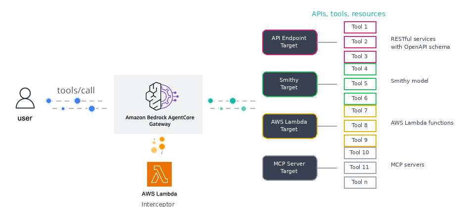
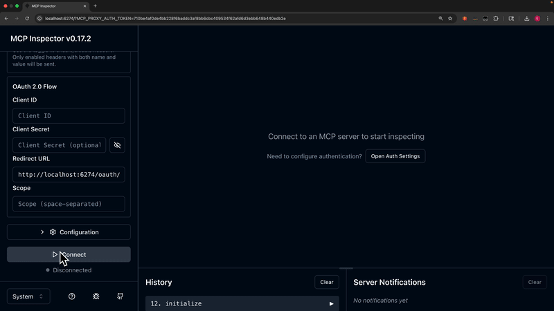

# Convert your MCP tools to respond with TOON instead of JSON

[Token-Oriented Object Notation](https://github.com/toon-format/toon) (TOON) is a compact, human-readable encoding of the JSON data model that minimizes tokens and makes structure easy for models to follow. It's intended for LLM input as a drop-in, lossless representation of your existing JSON.

TOON reaches 74% accuracy (vs JSON's 70%) while using ~40% fewer tokens in mixed-structure benchmarks across 4 models.





### TOON

```json
{
  "jsonrpc": "2.0",
  "id": "call-tool-request",
  "result": {
    "isError": false,
    "content": [
      {
        "type": "text",
        "text": "customers[2]:
  - customer_notes: Referred 3 new customers this quarter. Eligible for referral bonus credit.
    address_state: CA
    date_of_birth: 1951-11-21
    full_name: Jason Walker
    email: jason.walker52@gmail.com
    preferred_payment_method: Bank Transfer
    address_country: United States
    referral_source: Industry Blog
    average_order_value: 476.59
    subscription_tier: Free
    region: West
    last_login_at: "2025-09-29T01:31:16Z"
    last_modified_by: support-agent
    address_street: 2792 Orchard Lane
    tags[1]: at-risk
    loyalty_points: 49186
    created_at: "2022-09-25T18:31:16Z"
    sms_notifications_enabled: false
    customer_id: 0e54f30a-035a-4652-9341-39dc1540460c
    marketing_opt_in: false
    address_city: Los Angeles
    address_zip_code: "90001"
    gender: Prefer not to say
    account_status: Churned
    total_orders: 79
    total_lifetime_value: 8297.16
    last_name: Walker
    monthly_spend: 16.01
    first_name: Jason
    phone_number: +1-791-677-3102
    support_tickets_opened: 2
  - customer_notes: Downgraded from Premium to Standard tier. Consider retention offer.
    address_state: PA
    date_of_birth: 2007-02-04
    full_name: Cynthia Lopez
    email: cynthia.lopez448@gmail.com
    preferred_payment_method: American Express ending in 3782
    address_country: United States
    referral_source: Webinar
    average_order_value: 154.43
    subscription_tier: Basic
    region: Northeast
    last_login_at: "2025-10-18T00:31:16Z"
    last_modified_by: automated-process
    address_street: 5076 Sunset Boulevard
    tags[2]: beta-tester,early-adopter
    loyalty_points: 32861
    created_at: "2022-01-01T18:31:16Z"
    sms_notifications_enabled: false
    customer_id: 57ad5cdd-f156-4e83-85a7-ee184c71b42c
    marketing_opt_in: false
    address_city: Philadelphia
    address_zip_code: "19101"
    gender: Non-binary
    account_status: Pending Verification
    total_orders: 111
    total_lifetime_value: 40253.43
    last_name: Lopez
    monthly_spend: 104.48
    first_name: Cynthia
    phone_number: +1-647-703-7631
    support_tickets_opened: 4
count: 2
scanned_count: 2
last_evaluated_key:
  email: cynthia.lopez448@gmail.com
  customer_id: 57ad5cdd-f156-4e83-85a7-ee184c71b42c
has_more: true"
      }
    ]
  }
}
```

<details>
<summary>JSON</summary>

```json
{
  "jsonrpc": "2.0",
  "id": "call-tool-request",
  "result": {
    "isError": false,
    "content": [
      {
        "type": "text",
        "text": "{
  "customers": [
    {
      "customer_notes": "Referred 3 new customers this quarter. Eligible for referral bonus credit.",
      "address_state": "CA",
      "date_of_birth": "1951-11-21",
      "full_name": "Jason Walker",
      "email": "jason.walker52@gmail.com",
      "preferred_payment_method": "Bank Transfer",
      "address_country": "United States",
      "referral_source": "Industry Blog",
      "average_order_value": 476.59,
      "subscription_tier": "Free",
      "region": "West",
      "last_login_at": "2025-09-29T01:31:16Z",
      "last_modified_by": "support-agent",
      "address_street": "2792 Orchard Lane",
      "tags": ["at-risk"],
      "loyalty_points": 49186.0,
      "created_at": "2022-09-25T18:31:16Z",
      "sms_notifications_enabled": false,
      "customer_id": "0e54f30a-035a-4652-9341-39dc1540460c",
      "marketing_opt_in": false,
      "address_city": "Los Angeles",
      "address_zip_code": "90001",
      "gender": "Prefer not to say",
      "account_status": "Churned",
      "total_orders": 79.0,
      "total_lifetime_value": 8297.16,
      "last_name": "Walker",
      "monthly_spend": 16.01,
      "first_name": "Jason",
      "phone_number": "+1-791-677-3102",
      "support_tickets_opened": 2.0
    },
    {
      "customer_notes": "Downgraded from Premium to Standard tier. Consider retention offer.",
      "address_state": "PA",
      "date_of_birth": "2007-02-04",
      "full_name": "Cynthia Lopez",
      "email": "cynthia.lopez448@gmail.com",
      "preferred_payment_method": "American Express ending in 3782",
      "address_country": "United States",
      "referral_source": "Webinar",
      "average_order_value": 154.43,
      "subscription_tier": "Basic",
      "region": "Northeast",
      "last_login_at": "2025-10-18T00:31:16Z",
      "last_modified_by": "automated-process",
      "address_street": "5076 Sunset Boulevard",
      "tags": ["beta-tester", "early-adopter"],
      "loyalty_points": 32861.0,
      "created_at": "2022-01-01T18:31:16Z",
      "sms_notifications_enabled": false,
      "customer_id": "57ad5cdd-f156-4e83-85a7-ee184c71b42c",
      "marketing_opt_in": false,
      "address_city": "Philadelphia",
      "address_zip_code": "19101",
      "gender": "Non-binary",
      "account_status": "Pending Verification",
      "total_orders": 111.0,
      "total_lifetime_value": 40253.43,
      "last_name": "Lopez",
      "monthly_spend": 104.48,
      "first_name": "Cynthia",
      "phone_number": "+1-647-703-7631",
      "support_tickets_opened": 4.0
    }
  ],
  "count": 2,
  "scanned_count": 2,
  "last_evaluated_key": {
    "email": "cynthia.lopez448@gmail.com",
    "customer_id": "57ad5cdd-f156-4e83-85a7-ee184c71b42c"
  },
  "has_more": true
}"
      }
    ]
  }
}
```

</details>

## [When Not to Use TOON](https://github.com/toon-format/toon?tab=readme-ov-file#when-not-to-use-toon)

- If an `Output Schema` is defined in your MCP tool schema, do not use TOON, as it is incompatible with schema-based validation and can cause structured outputs to fail validation. For details, see the official [documentation](https://modelcontextprotocol.io/specification/2025-06-18/server/tools#output-schema).

TOON excels with uniform arrays of objects, but there are cases where other formats are better:

- Deeply nested or non-uniform structures (tabular eligibility ≈ 0%): JSON-compact often uses fewer tokens. Example: complex configuration objects with many nested levels.
- Semi-uniform arrays (~40–60% tabular eligibility): Token savings diminish. Prefer JSON if your pipelines already rely on it.
- Pure tabular data: CSV is smaller than TOON for flat tables. TOON adds minimal overhead (~5-10%) to provide structure (array length declarations, field headers, delimiter scoping) that improves LLM reliability.
- Latency-critical applications: If end-to-end response time is your top priority, benchmark on your exact setup. Some deployments (especially local/quantized models like Ollama) may process compact JSON faster despite TOON's lower token count. Measure TTFT, tokens/sec, and total time for both formats and use whichever is faster.
- See [benchmarks](https://github.com/toon-format/toon?tab=readme-ov-file#benchmarks) for concrete comparisons across different data structures.

## Prerequisites

- [AWS CLI](https://aws.amazon.com/cli/) configured with appropriate credentials
- [AWS CDK](https://aws.amazon.com/cdk/) v2 installed (`npm install -g aws-cdk`)
- [uv](https://github.com/astral-sh/uv) for Python package management
- Python 3.11+
- Node.js 18+ (for interceptor Lambda)
- [Docker](https://www.docker.com/) intalled and running

## Deploy

1. Create virtual environment

   ```bash
   uv sync
   source .venv/bin/activate
   ```

2. Bootstrap CDK (first time only)

   ```bash
   cdk bootstrap
   ```

3. Deploy infrastructure

   ```bash
   # Deploy with dev environment (default)
   cdk deploy --all

   # Deploy with prod environment
   cdk deploy --all -c environment=prod

   # Deploy with test environment
   cdk deploy --all -c environment=test
   ```

## Scripts

### List and Invoke MCP Gateway Tools

```bash
# List available tools
uv run scripts/mcp_toon.py -e dev

# Invoke batch_get_customers
uv run scripts/mcp_toon.py -e dev -i customers-crud___batch_get_customers

# Invoke query_by_region with arguments
uv run scripts/mcp_toon.py -e dev -i customers-crud___query_by_region -a '{"region": "Northeast"}'

# Invoke query_by_tier with arguments
uv run scripts/mcp_toon.py -e dev -i customers-crud___query_by_tier -a '{"subscription_tier": "Premium", "limit": 10}'

# Invoke get_customer
uv run scripts/mcp_toon.py -e dev -i customers-crud___get_customer -a '{"customer_id": "abc123"}'

# Invoke scan_customers with pagination
uv run scripts/mcp_toon.py -e dev -i customers-crud___scan_customers -a '{"limit": 10}'
```

### Get Bearer Token

```bash
# Get token with verbose output
uv run scripts/get_token.py -e dev

# Get token only (for scripting)
uv run scripts/get_token.py -e dev -q
```

### Script Options

**mcp_toon.py**

| Option | Short | Description |
|--------|-------|-------------|
| `--environment` | `-e` | Environment (dev, test, prod). Default: dev |
| `--gateway-url` | `-g` | Gateway URL (fetched from SSM if not provided) |
| `--invoke` | `-i` | Tool name to invoke |
| `--args` | `-a` | JSON arguments for the tool |

**get_token.py**

| Option | Short | Description |
|--------|-------|-------------|
| `--environment` | `-e` | Environment (dev, test, prod). Default: dev |
| `--quiet` | `-q` | Only print the token (no extra output) |

## Cleanup

```bash
# Destroy all stacks
cdk destroy --all

# Destroy specific stack
cdk destroy GatewayStack
```
