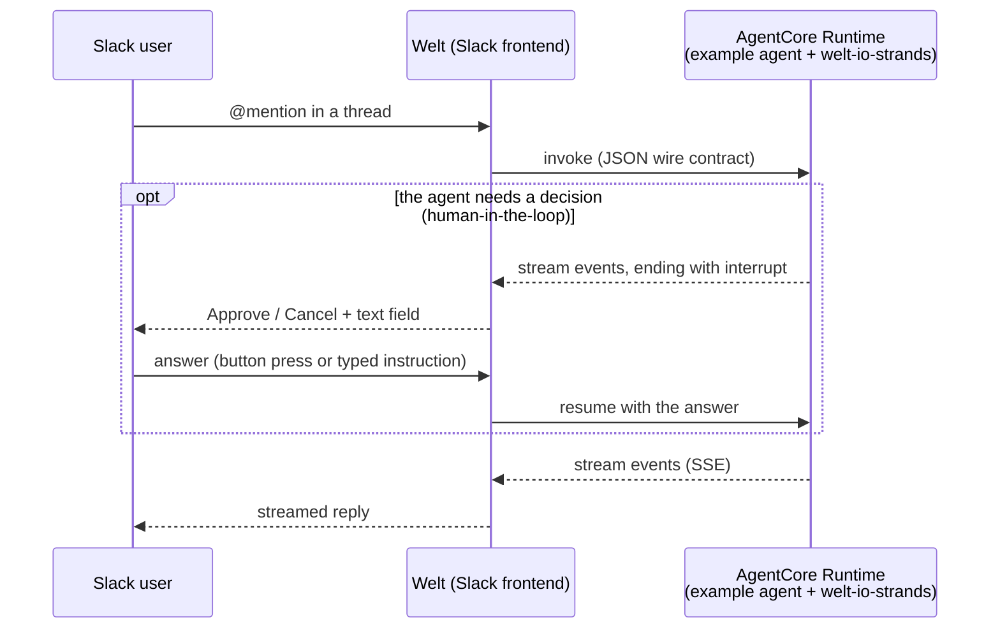

# Slack Chat Interface with Human-in-the-Loop

| Information        | Details                                                |
|--------------------|--------------------------------------------------------|
| Agent type         | Asynchronous (streaming)                               |
| Agentic Framework  | Strands Agents                                         |
| LLM model          | Anthropic Claude (Strands default)                     |
| Components         | AgentCore Runtime, Slack (via Welt)                    |
| Example complexity | Intermediate                                           |
| SDK used           | Amazon Bedrock AgentCore Python SDK, welt-io-strands   |

This example puts an agent deployed on Amazon Bedrock AgentCore Runtime behind a Slack chat interface: mention it in a thread, watch its reply stream back, and — when the agent needs a decision — answer an approval prompt inline before it continues. [Welt](https://github.com/iwamot/welt) handles the Slack side; the agent and Welt exchange a small JSON [wire contract](https://github.com/iwamot/welt/blob/main/docs/wire.md), which the [welt-io-strands](https://github.com/iwamot/welt-io-strands) adapter translates to and from Strands values, so the agent code stays plain Strands.

## Architecture



## Prerequisites

- Python 3.10 or higher
- uv
- AWS CLI configured with credentials, and access to Amazon Bedrock AgentCore
- Access enabled for a Bedrock model the agent can call — the Strands default is an Anthropic Claude model; the `generate_image` tool uses a Stability AI image model in `us-west-2`
- A Slack workspace where you can install an app

Welt invokes the deployed agent with the verified Slack identity as the `runtimeUserId`, so the credentials Welt runs with need both `bedrock-agentcore:InvokeAgentRuntime` and `bedrock-agentcore:InvokeAgentRuntimeForUser` on the agent's runtime ARN.

## Setup

### 1. Create a Slack app

Create a Slack app from Welt's [`manifest.yml`](https://github.com/iwamot/welt/blob/main/manifest.yml): generate an app-level token with the `connections:write` scope (`xapp-1-...`), then install the app to your workspace and copy the bot token (`xoxb-...`).

### 2. Deploy the example agent

Clone this repository and change into this directory:

```bash
git clone https://github.com/awslabs/agentcore-samples.git
cd agentcore-samples/03-integrations/ux-examples/slack-welt
```

Deploy [`example/agent.py`](example/agent.py) to AgentCore Runtime with the [AgentCore CLI](https://github.com/aws/agentcore-cli):

```bash
agentcore create --name WeltExample --framework Strands --model-provider Bedrock --memory none
cp example/agent.py WeltExample/app/WeltExample/main.py
cd WeltExample
uv add --project app/WeltExample welt-io-strands strands-agents-tools
agentcore deploy
```

Note the agent runtime ARN from the deploy output — Welt's `AGENT_ARN` points at it. Set `MODEL_ID` to another Converse model if you prefer; unset, the agent uses the Strands default.

> Prefer to try it before deploying? Welt's [Quick Start](https://github.com/iwamot/welt#quick-start) runs both the agent and Welt on your machine first.

### 3. Run Welt

Clone Welt:

```bash
git clone https://github.com/iwamot/welt.git
cd welt
```

Save the tokens and the agent runtime ARN in a `.env` file at the repository root:

```sh
SLACK_APP_TOKEN=xapp-1-...
SLACK_BOT_TOKEN=xoxb-...
AGENT_ARN=arn:aws:bedrock-agentcore:...
```

And run it:

```bash
uv run --env-file .env main.py
```

Welt invokes the deployed agent through the standard AWS SDK, so run it where AWS credentials are available — environment variables, a profile, or an SSO session. Welt's [README](https://github.com/iwamot/welt#readme) covers the Slack app setup and every supported variable; for hosting it instead of running it locally, the same process ships as the container image `ghcr.io/iwamot/welt`.

## Usage

Invite the app to a channel (`/invite @YourApp`) and mention it, or send it a direct message. Welt streams the reply into a thread:

- **Streaming + tool use**: `@YourApp what time is it?`
- **File output**: `@YourApp draw a picture of a cat`
- **Human-in-the-loop**: `@YourApp deploy to prod` → the run pauses with **Approve** / **Cancel** buttons and a text field. Press a button, or type an instruction like `run the tests first`; the run resumes on whichever comes first.

## How it works

[`example/agent.py`](example/agent.py) is a standalone agent you deploy to AgentCore Runtime. Its `@app.entrypoint` function receives Welt's payload and streams events back:

- A conversation turn arrives as [Bedrock Converse-shaped `messages`](https://docs.aws.amazon.com/bedrock/latest/APIReference/API_runtime_Message.html); `decode_messages` restores any uploaded file bytes, and the agent streams a reply.
- `renderable_events` reduces the raw Strands `stream_async` events to the JSON events Welt renders — text, tool-use indicators, file uploads, and interrupts.
- On an interrupt, the stream ends with an `interrupt` event and the agent is held for the session; Welt posts the buttons, and the answer returns as `interrupt_responses`, which `decode_interrupt_responses` turns into the values that resume the run.

The example agent's tools are `current_time` (text streaming), `generate_image` (uploads a file into the thread), and `sample_dangerous_action` (a no-op that pauses for approval). See [Welt's Interrupts doc](https://github.com/iwamot/welt/blob/main/docs/interrupts.md) for how each prompt renders and resumes.

## Resources

- [Welt](https://github.com/iwamot/welt) — the Slack frontend, its wire contract, and setup
- [welt-io-strands](https://github.com/iwamot/welt-io-strands) — the Strands adapter and its example agent
- [Amazon Bedrock AgentCore Documentation](https://docs.aws.amazon.com/bedrock-agentcore/)
- [Strands Agents](https://github.com/strands-agents/sdk-python)
