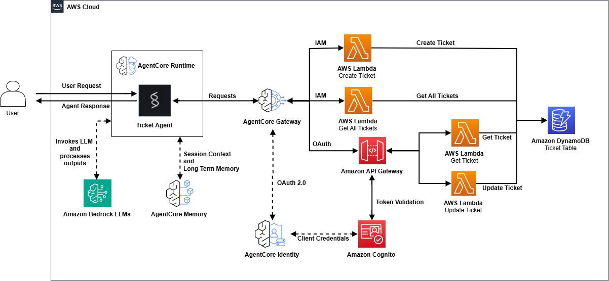

# AgentCore Gateway with Authentication Patterns

## Table of Contents

- [Overview](#overview)
- [Architecture](#architecture)
- [Prerequisites](#prerequisites)
- [Deployment](#deployment)
- [Testing](#testing)
- [Cleanup](#cleanup)
- [Troubleshooting](#troubleshooting)
- [Attribution](#attribution)
- [License](#license)

## Overview

This CDK stack demonstrates Amazon Bedrock AgentCore Gateway workflows and authentication patterns by deploying a complete ticket management system with both IAM and OAuth authentication methods.

### What This Demo Shows

This demo showcases:

**AgentCore Gateway Integration**:
- Gateway setup with MCP protocol for dynamic tool discovery
- Gateway Target configuration for both direct Lambda invocation and API Gateway routing
- AgentCore Runtime-to-Gateway communication with SigV4 authentication

**Authentication Patterns**:

*Inbound Authentication (AgentCore Runtime to AgentCore Gateway)*:
- IAM with SigV4 signing

*Outbound Authentication (AgentCore Gateway to Target Services)*:
- **IAM**: AgentCore Gateway uses IAM role to invoke Lambda functions directly
- **OAuth**: AgentCore Gateway uses OAuth credentials from Cognito (machine-to-machine) to authenticate with API Gateway

**Use Case Scenario**:
- IT support ticket system for tracking technical issues and requests
- Users can create tickets for problems (e.g., IT support and technical problems)
- Tickets have approval workflow (PENDING/APPROVED/REJECTED) and implementation status (NOT_STARTED/IN_PROGRESS/COMPLETED)
- Users can list all tickets with optional status filtering
- Users can retrieve specific ticket details with ownership validation
- Users can update ticket comments and status

## Architecture



### Components

**Core Services**:
- **AgentCore Runtime**: Hosts Strands agent with MCP client for dynamic tool discovery
- **AgentCore Gateway**: Routes tool calls with authentication support (IAM and OAuth)
- **DynamoDB Table**: Stores ticket data with RequestId as partition key
- **Cognito User Pool**: OAuth 2.0 token provider for machine-to-machine authentication
- **API Gateway**: REST API with Cognito authorizer for OAuth-protected endpoints
- **Lambda Functions**: Four ticket management handlers with DynamoDB access

**Supporting Services**:
- **ECR Repository**: Container image storage for agent runtime
- **CodeBuild**: Automated Docker image building for ARM64 architecture
- **S3 Bucket**: YAML template storage
- **Secrets Manager**: Secure storage for Cognito client credentials
- **CloudWatch**: Centralized logging and monitoring

### Authentication Flows

**Inbound Authentication (AgentCore Runtime to AgentCore Gateway)**:

AgentCore Runtime uses IAM with SigV4 signing to authenticate all requests to AgentCore Gateway:

1. AgentCore Runtime (IAM role) signs request with SigV4 signature
2. AgentCore Gateway validates the signature

**Outbound Authentication (AgentCore Gateway to Target Services)**:

*IAM Pattern* (create_ticket, get_all_tickets):

1. AgentCore Gateway (IAM role) directly invokes Lambda function
2. Lambda function reads/writes to DynamoDB

*OAuth Pattern* (get_ticket, update_ticket):

1. AgentCore Gateway requests OAuth token from Cognito using client_credentials flow
2. Cognito returns OAuth token
3. AgentCore Gateway sends request to API Gateway with Bearer token
4. API Gateway validates the token
5. API Gateway invokes Lambda function
6. Lambda function reads/writes to DynamoDB

## Prerequisites

### AWS Account Setup

1. **AWS Account**: Active AWS account with administrative permissions
   - [Create AWS Account](https://aws.amazon.com/account/)
   - [AWS Console Access](https://aws.amazon.com/console/)

2. **AWS CLI**: Install and configure AWS CLI version 2 with your credentials
   - [Install AWS CLI](https://docs.aws.amazon.com/cli/latest/userguide/getting-started-install.html)
   - [Configure AWS CLI](https://docs.aws.amazon.com/cli/latest/userguide/cli-configure-quickstart.html)
   
   ```bash
   aws configure
   ```

3. **Python 3.11+** and **AWS CDK v2** installed
   ```bash
   # Install CDK globally
   npm install -g aws-cdk
   
   # Verify installation
   cdk --version
   ```

4. **Bedrock Model Access**: This demo uses Claude Sonnet 4
   - For Anthropic models, first-time users may need to submit use case details via the [Amazon Bedrock Console](https://console.aws.amazon.com/bedrock/) playground or PutUseCaseForModelAccess API
   - See [Bedrock Model Access Guide](https://docs.aws.amazon.com/bedrock/latest/userguide/model-access.html) for complete details

### Required Permissions

Your AWS user or role needs permissions to:

**For deployment:**
- CloudFormation stacks and change sets
- ECR repositories and images
- Lambda functions and execution roles
- DynamoDB tables
- S3 buckets and objects
- API Gateway REST APIs
- Cognito User Pools and clients
- Secrets Manager secrets
- IAM roles and policies
- BedrockAgentCore resources (Runtime, Gateway, Memory)
- CodeBuild projects and builds
- CloudWatch log groups

**For testing:**
- BedrockAgentCore Runtime invocation (bedrock-agentcore:InvokeRuntime)

### Product Versions

- **AWS CDK CLI**: v2.1105.0 or later (tested with 2.1106.1)
- **AWS CDK Library (aws-cdk-lib)**: v2.220.0 or later (tested with 2.239.0)
- **Python**: 3.11 or later (tested with 3.14.3)
- **Node.js**: 18.x or later (tested with 25.6.1)
- **AWS CLI**: 2.x (tested with 2.28.4)
- **Docker**: Not required (CodeBuild handles image building)

## Deployment

### Quick Deploy

```bash
# 1. Install Python dependencies
pip install -r requirements.txt

# 2. Bootstrap CDK (first time only in your account/region)
cdk bootstrap

# 3. Deploy the stack
cdk deploy
```

### Step-by-Step Deployment

```bash
# 1. Create and activate Python virtual environment
python3 -m venv .venv
source .venv/bin/activate  # On Windows: .venv\Scripts\activate

# 2. Install Python dependencies
pip install -r requirements.txt

# 3. Bootstrap CDK in your account/region (first time only)
cdk bootstrap

# 4. Synthesize CloudFormation template (optional - for review)
cdk synth

# 5. Deploy the stack
cdk deploy --require-approval never

# 6. Save stack outputs to file (optional)
cdk deploy --outputs-file outputs.json
```

### Important Stack Outputs

After deployment completes, note these outputs for testing:

- **RuntimeArn**: AgentCore Runtime ARN (required for test_agent.py script)
- **TableName**: DynamoDB table name (for debugging: `aws dynamodb scan --table-name tickets-auth-demo`)
- **MemoryId**: AgentCore Memory ID (stores user preferences and conversation context)

You can retrieve outputs anytime with:
```bash
aws cloudformation describe-stacks \
  --stack-name AgentcoreGatewayWithAuthStack \
  --query 'Stacks[0].Outputs'
```

## Testing

The `testing/` folder contains:
- **test_agent.py**: Interactive Python script for conversational testing
- **TESTING.md**: Complete testing guide with two methods (AWS Console + Interactive Script)

For detailed testing instructions, sample queries, and troubleshooting, see [testing/TESTING.md](testing/TESTING.md).

### Quick Start

```bash
cd testing
python test_agent.py
```

The script will prompt you for:
- **Runtime ARN**: From CDK stack outputs
- **user_id**: Any identifier (e.g., `user123`)
- **session_id**: Minimum 33 characters (e.g., `session-user123-demo-testing-0001`)

## Cleanup

### Method 1: Using CDK

```bash
cdk destroy
```

### Method 2: Using AWS CLI

If you prefer using AWS CLI directly:

```bash
aws cloudformation delete-stack --stack-name AgentcoreGatewayWithAuthStack

# Wait for deletion to complete
aws cloudformation wait stack-delete-complete --stack-name AgentcoreGatewayWithAuthStack
```

### Method 3: Using AWS Console

1. Navigate to [CloudFormation Console](https://console.aws.amazon.com/cloudformation/)
2. Select the `AgentcoreGatewayWithAuthStack` stack
3. Click "Delete" and confirm
4. Wait for deletion to complete

### Post-Cleanup: CloudWatch Log Groups (Optional)

CloudWatch Log Groups are retained by default to preserve logs for auditing. To delete them:

1. Navigate to [CloudWatch Console](https://console.aws.amazon.com/cloudwatch/)
2. Click "Log Management" in the left navigation under "Logs" section
3. Search for log groups related to this stack:
   - `/aws/lambda/AgentcoreGatewayWithAuthStack...`
   - `/aws/bedrock-agentcore/runtimes/AgentcoreGatewayWithAuthStack...`
   - `/aws/codebuild/AgentcoreGatewayWithAuthStack...`
4. Select the log groups you want to delete
5. Click "Actions" --> "Delete log group(s)" and confirm


## Troubleshooting

### CDK Bootstrap Required

If you see errors about missing CDK bootstrap resources:

```bash
cdk bootstrap aws://ACCOUNT-NUMBER/REGION
```

Replace `ACCOUNT-NUMBER` with your AWS account ID and `REGION` with your target region (e.g., `us-east-1`).

### Permission Issues

**Error**: "User is not authorized to perform: [action]"

**Solution**: Ensure your IAM user or role has:
- `CDKToolkit` permissions or equivalent
- Permissions to create all resources in the stack
- `iam:PassRole` permission for creating service roles

Check the [Prerequisites](#prerequisites) section for the complete list of required permissions.

### Python Dependencies

**Error**: "ModuleNotFoundError" or import errors

**Solution**: Install dependencies in the project directory:
```bash
pip install -r requirements.txt
```

If using a virtual environment, ensure it's activated:
```bash
source .venv/bin/activate  # On Windows: .venv\Scripts\activate
```

### CodeBuild Failures

**Error**: Docker image build fails during deployment

**Solution**: Check CodeBuild logs:
1. Go to [CodeBuild Console](https://console.aws.amazon.com/codesuite/codebuild/)
2. Find the build project (name contains "agent-build")
3. Click on the project name
4. Check "Build history" tab for recent builds
5. Click on the failed build to view detailed logs

### Runtime Issues

**Error**: Agent fails to start or respond

**Solution**: Check CloudWatch logs:
1. Go to [CloudWatch Console](https://console.aws.amazon.com/cloudwatch/)
2. Navigate to "Log Management" in the left sidebar
3. Find log group: `/aws/bedrock-agentcore/runtime/...`
4. Check recent log streams for error messages

Additionally, check for:
- Invalid environment variables
- Gateway URL not accessible
- IAM role missing permissions
- Model access not enabled in Bedrock

### Session ID Validation

**Error**: "Invalid session ID" or session-related errors

**Requirements**: Session IDs must be:
- Minimum 33 characters long
- Match pattern: `[a-zA-Z0-9][a-zA-Z0-9-_]*`
- Start with alphanumeric character
- Contain only alphanumeric, hyphens, and underscores

**Valid Examples**:
- `session-user123-demo-testing-0001` (36 characters)
- `session-default-fallback-demo-testing-0001` (44 characters)

**Invalid Examples**:
- `session-123` (too short, only 11 characters)
- `-session-user123` (starts with hyphen)
- `session user123` (contains space)

### Stack Deletion Failures

**Error**: Stack deletion fails with "Resource cannot be deleted"

**Solution**: 

1. Check the "Events" tab in [CloudFormation Console](https://console.aws.amazon.com/cloudformation/) to identify which resource is blocking deletion
2. Resolve the blocking resource (see [Cleanup section](#cleanup) for details)
3. Retry deletion using any method from the Cleanup section

## Attribution

The following files reference and adapt code from the [AWS Bedrock AgentCore Samples](https://github.com/awslabs/amazon-bedrock-agentcore-samples) repository:

- `infra_utils/agentcore_role.py` - Source: `04-infrastructure-as-code/cdk/python/basic-runtime/infra_utils/agentcore_role.py`
- `infra_utils/build_trigger_lambda.py` - Source: `04-infrastructure-as-code/cdk/python/basic-runtime/infra_utils/build_trigger_lambda.py`
- `agent-code/streamable_http_sigv4.py` - Source: `01-tutorials/02-AgentCore-gateway/01-transform-lambda-into-mcp-tools/streamable_http_sigv4.py`
- `agent-code/Dockerfile` - Source: `04-infrastructure-as-code/cdk/python/basic-runtime/agent-code/Dockerfile`

## License

This project is licensed under the Apache License 2.0. See the LICENSE and NOTICE files in the repository root for details.
