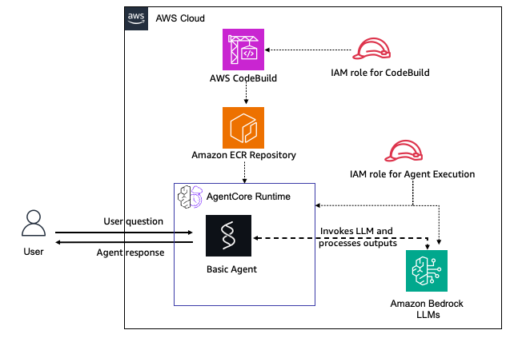

# Basic AgentCore Runtime - Pulumi

## Overview

This Pulumi stack deploys the simplest possible Amazon Bedrock AgentCore Runtime with a basic [Strands](https://github.com/strands-agents/strands-agents-python) agent. It is the ideal starting point for understanding AgentCore concepts without additional complexity from tools or integrations.

The agent is a simple Q&A assistant powered by Amazon Bedrock LLMs. It packages the code from `agent-code/`, uploads it to S3, uses AWS CodeBuild to build and push an ARM64 container image to ECR, and then creates the AgentCore runtime from that image.

The deployment flow follows the same pattern as the AWS CDK sample: CodeBuild is triggered from managed AWS infrastructure during the Pulumi deployment, not from local shell scripts.

### Tutorial Details

| Information         | Details                                      |
| :------------------ | :------------------------------------------- |
| Tutorial type       | Basic Runtime                                |
| Tool type           | Strands Agent (no additional tools)          |
| Tutorial components | Pulumi, AgentCore Runtime, Strands Agent     |
| Tutorial vertical   | Cross-vertical                               |
| Example complexity  | Beginner                                     |
| SDK used            | Strands Agents, Amazon Bedrock AgentCore SDK |

### Key Features

- **Complete Infrastructure as Code** - Full Pulumi TypeScript implementation
- **Minimal Complexity** - No tools, no auth, just agent + LLM
- **Automated Build** - CodeBuild creates ARM64 Docker images during deployment
- **Easy Testing** - Automated test script included
- **Simple Cleanup** - One command removes all resources
- **ESC Integration** - Supports Pulumi ESC with AWS OIDC for short-lived credentials

### Use Cases

- Learning AgentCore basics
- Quick prototyping
- Understanding the core deployment pattern
- Building a foundation before adding complexity

## Architecture



The architecture consists of:

- **User**: Sends questions to the agent and receives responses
- **AWS CodeBuild**: Builds the ARM64 Docker container image with the agent code
- **Amazon ECR Repository**: Stores the container image
- **AgentCore Runtime**: Hosts the Basic Agent container
  - **Basic Agent**: Simple Strands agent that processes user queries
  - Invokes Amazon Bedrock LLMs to generate responses
- **IAM Roles**:
  - IAM role for CodeBuild (builds and pushes images)
  - IAM role for Agent Execution (runtime permissions)
  - IAM role for build-trigger Lambda (starts CodeBuild)

## What Gets Deployed

The Pulumi stack creates:

- **S3 Bucket** - Stores agent source code for CodeBuild
- **Amazon ECR Repository** - Stores the agent Docker image
- **AWS CodeBuild Project** - Builds ARM64 Docker image automatically
- **Lambda Function** - Build trigger that starts CodeBuild and waits for completion
- **Amazon Bedrock AgentCore Runtime** - Hosts the basic Strands agent
- **IAM Roles** - Least-privilege permissions for AgentCore, CodeBuild, and Lambda

## Prerequisites

### Required Accounts and Access

1. AWS account with permission to create:
   - IAM roles and policies
   - S3 buckets and objects
   - ECR repositories
   - CodeBuild projects
   - Lambda functions
   - Bedrock AgentCore runtimes
2. Access to Amazon Bedrock models in the target AWS region
3. A Pulumi account if you use the default Pulumi Cloud backend
   - Run `pulumi login`
   - If you use another backend, log in to that backend instead

### Required Tools

1. Pulumi CLI
2. Node.js 18 or later
3. npm
4. AWS CLI
5. Python 3.11 or later for the local test script

### Authentication

Pulumi supports multiple AWS authentication methods. See the AWS provider configuration docs for the supported options:

- https://www.pulumi.com/registry/packages/aws/installation-configuration/

The preferred option for this example is Pulumi ESC with AWS OIDC so Pulumi can use short-lived AWS credentials instead of long-lived local credentials:

- https://www.pulumi.com/docs/esc/environments/configuring-oidc/aws/
- https://www.pulumi.com/docs/esc/guides/configuring-oidc/aws/

If you use ESC, the stack must import an environment in the form `<esc-project>/<esc-environment>` that grants AWS access for the target account.

## Install

```bash
npm install
pulumi login
pulumi stack select dev || pulumi stack init dev
pulumi config env add <esc-project>/<esc-environment> -s dev --yes
```

The `pulumi config env add` command adds the ESC environment to the stack import list:

- https://www.pulumi.com/docs/iac/cli/commands/pulumi_config_env_add/

Set the AWS region if it is not supplied by your ESC environment:

```bash
pulumi config set aws:region us-east-1 -s dev
```

Optional stack settings:

```bash
pulumi config set agentName BasicAgent -s dev
pulumi config set stackName agentcore-basic -s dev
pulumi config set imageTag latest -s dev
pulumi config set networkMode PUBLIC -s dev
```

## Deploy

Preview the resources that will be created:

```bash
pulumi preview -s dev
```

Deploy the stack:

```bash
pulumi up -s dev
```

Expected deployment flow:

1. Pulumi creates the S3, ECR, IAM, Lambda, and CodeBuild resources.
2. Pulumi invokes the build-trigger Lambda.
3. The Lambda starts the CodeBuild project and waits for a successful image push.
4. Pulumi creates or updates the AgentCore runtime with the built image.

Typical deployment time is about 8 to 12 minutes, with most of that in CodeBuild.

## Outputs

After deployment:

```bash
pulumi stack output -s dev
```

Important outputs:

| Output                 | Description                            |
| ---------------------- | -------------------------------------- |
| `agentRuntimeArn`      | ARN of the AgentCore runtime           |
| `agentRuntimeId`       | ID of the AgentCore runtime            |
| `ecrRepositoryUrl`     | ECR repository URL for the agent image |
| `codebuildProjectName` | Name of the CodeBuild project          |
| `sourceBucketName`     | S3 bucket for agent source code        |

## Testing

### Install Test Dependencies

```bash
python3 -m venv .venv
source .venv/bin/activate
pip install boto3
```

### Run the Test Script

```bash
python test_basic_agent.py "$(pulumi stack output agentRuntimeArn -s dev)"
```

If you use Pulumi ESC for AWS credentials:

```bash
RUNTIME_ARN=$(pulumi stack output agentRuntimeArn -s dev)
pulumi env run <esc-project>/<esc-environment> -- python test_basic_agent.py "$RUNTIME_ARN"
```

### Invoke Directly with AWS CLI

```bash
RUNTIME_ARN=$(pulumi stack output agentRuntimeArn -s dev)

aws bedrock-agentcore invoke-agent-runtime \
  --agent-runtime-arn "$RUNTIME_ARN" \
  --qualifier DEFAULT \
  --payload "$(echo '{"prompt":"Hello, introduce yourself"}' | base64)" \
  response.json

cat response.json
```

### Expected Output

```
================================================================================
BASIC AGENT TEST SUITE
================================================================================

Agent ARN: arn:aws:bedrock-agentcore:us-east-1:123456789012:runtime/abc123
Region: us-east-1

================================================================================
TEST: Simple Greeting
================================================================================

Prompt: 'Hello! Can you introduce yourself?'
Status: 200

✅ Response:
Hello! I'm a helpful assistant...

================================================================================
TEST: Reasoning Task
================================================================================

Prompt: 'Explain what cloud computing is in simple terms and list three key benefits.'
Status: 200

✅ Response:
Cloud computing is...

================================================================================
TEST SUMMARY
================================================================================
✅ PASSED - Simple Greeting
✅ PASSED - Reasoning Task

================================================================================
✅ ALL TESTS PASSED
================================================================================
```

### Sample Queries

Try these queries to test the basic agent:

| Query                             | Description        |
| :-------------------------------- | :----------------- |
| `Hello, how are you?`             | Simple greeting    |
| `What is the capital of France?`  | Question answering |
| `Write a short poem about clouds` | Creative writing   |
| `How do I bake a chocolate cake?` | Problem solving    |

### Customization

Edit `agent-code/basic_agent.py` to change the agent behavior:

```python
# agent-code/basic_agent.py
def create_basic_agent() -> Agent:
    system_prompt = """You are a helpful coding assistant.
    Answer programming questions with code examples."""

    return Agent(system_prompt=system_prompt, name="CodingAgent")
```

Changes are automatically detected and trigger a rebuild on the next `pulumi up`.

## Cleanup

Remove all resources:

```bash
pulumi destroy -s dev
```

If you also want to remove the stack state:

```bash
pulumi stack rm dev
```

## Troubleshooting

### Build Failures

Check CodeBuild logs in the AWS Console:

1. Go to the CodeBuild console
2. Find the build project (name contains `basic-agent-build`)
3. Check build history and logs

Common causes:

- Network connectivity issues during Docker image pull
- ECR authentication problems
- Python dependency conflicts in `agent-code/requirements.txt`

### Runtime Creation Fails

If the AgentCore runtime fails to create:

1. Verify the Docker image exists in ECR
2. Check IAM role permissions
3. Verify Bedrock AgentCore service quotas in your region

### Runtime Issues

If the runtime fails to start or returns errors:

1. Check CloudWatch logs for the runtime
2. Verify the Docker image was built successfully
3. Ensure the agent execution IAM role has `BedrockAgentCoreFullAccess`
4. Confirm Bedrock model access is enabled in your region

### Permission Issues

Ensure your AWS credentials have permissions to create all resources in the stack, including `iam:PassRole` for service roles.

## Cost Estimate

### Monthly Cost Breakdown (us-east-1)

| Service               | Usage                                | Monthly Cost |
| --------------------- | ------------------------------------ | ------------ |
| **AgentCore Runtime** | 1 runtime, minimal usage             | ~$5-10       |
| **ECR Repository**    | 1 repository, less than 1 GB storage | ~$0.10       |
| **CodeBuild**         | Occasional builds                    | ~$1-2        |
| **Lambda**            | Build trigger executions             | ~$0.01       |
| **S3**                | Source code archive                  | ~$0.01       |
| **CloudWatch Logs**   | Runtime and build logs               | ~$0.50       |
| **Bedrock Model**     | Pay per token                        | Variable\*   |

**Estimated Total: ~$7-13/month** (excluding Bedrock model usage)

\*Bedrock costs depend on your usage patterns and chosen models. See [Bedrock Pricing](https://aws.amazon.com/bedrock/pricing/) for details.

### Cost Optimization

- **Delete when not in use**: Run `pulumi destroy -s dev` to remove all resources
- **Monitor usage**: Set up CloudWatch billing alarms
- **Choose efficient models**: Select appropriate Bedrock models for your use case
- **Rebuild only when needed**: CodeBuild only runs when source code or buildspec changes
