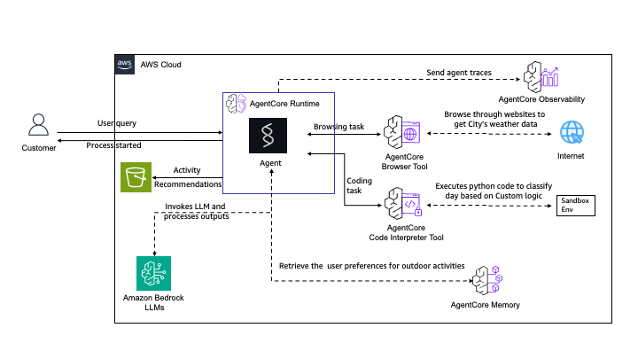

# End-to-End Weather Agent with Tools and Memory - Pulumi

## Overview

This Pulumi stack deploys a complete Amazon Bedrock AgentCore Runtime with a sophisticated weather-based activity planning agent. It demonstrates the full power of AgentCore by integrating Browser tool, Code Interpreter, Memory, and S3 storage in a single deployment.

The agent uses the [Strands](https://github.com/strands-agents/strands-agents-python) framework with multiple AgentCore tools to scrape weather data, analyze forecasts, retrieve user preferences from memory, and generate personalized activity recommendations.

The deployment flow follows the same pattern as the AWS CDK sample: CodeBuild and memory initialization are triggered from managed AWS infrastructure during the Pulumi deployment, not from local shell scripts.

### Tutorial Details

| Information         | Details                                                          |
| :------------------ | :--------------------------------------------------------------- |
| Tutorial type       | End-to-End Agent with Tools                                      |
| Tool type           | Strands Agent with Browser, Code Interpreter, Memory             |
| Tutorial components | Pulumi, AgentCore Runtime, Browser, Code Interpreter, Memory, S3 |
| Tutorial vertical   | Cross-vertical                                                   |
| Example complexity  | Advanced                                                         |
| SDK used            | Strands Agents, Amazon Bedrock AgentCore Python SDK              |

### Key Features

- **Complete Infrastructure as Code** - Full Pulumi TypeScript implementation
- **Multi-Tool Integration** - Browser, Code Interpreter, and Memory working together
- **Automated Build** - CodeBuild creates ARM64 Docker images during deployment
- **Memory Initialization** - Lambda populates activity preferences on first deploy
- **Observability** - CloudWatch Logs and X-Ray traces delivery configured
- **Easy Testing** - Automated test script included
- **Simple Cleanup** - One command removes all resources
- **ESC Integration** - Supports Pulumi ESC with AWS OIDC for short-lived credentials

### Agent Capabilities

The Weather Activity Planner agent can:

1. **Scrape Weather Data** - Uses browser automation to fetch 8-day forecasts from weather.gov
2. **Analyze Weather** - Generates and executes Python code to classify days as GOOD/OK/POOR
3. **Retrieve Preferences** - Accesses user activity preferences from memory
4. **Generate Recommendations** - Creates personalized activity suggestions based on weather and preferences
5. **Store Results** - Saves recommendations as Markdown files in S3

### Use Cases

- Weather-based activity planning
- Automated web scraping and data analysis
- Multi-tool agent orchestration
- Memory-driven personalization
- Asynchronous task processing

## Architecture



The architecture demonstrates a complete AgentCore deployment with multiple integrated tools:

- **User**: Sends weather-based activity planning queries
- **AWS CodeBuild**: Builds the ARM64 Docker container image with the agent code
- **Amazon ECR Repository**: Stores the container image
- **AgentCore Runtime**: Hosts the Weather Activity Planner Agent
  - **Weather Agent**: Strands agent that orchestrates multiple tools
  - Invokes Amazon Bedrock LLMs for reasoning and code generation
- **Browser Tool**: Web automation for scraping weather data from weather.gov
- **Code Interpreter Tool**: Executes Python code for weather analysis
- **Memory**: Stores user activity preferences (30-day event expiry)
- **S3 Results Bucket**: Stores generated activity recommendations
- **IAM Roles**: Least-privilege permissions for all components
- **Observability**: CloudWatch Logs and X-Ray traces delivery

### Agent Workflow

1. User sends query (e.g., "What should I do this weekend in Richmond VA?")
2. Agent extracts city and uses Browser Tool to scrape 8-day forecast from weather.gov
3. Agent generates Python code and uses Code Interpreter to classify weather days
4. Agent retrieves user preferences from Memory
5. Agent generates personalized recommendations
6. Agent stores results as Markdown in S3 bucket using the `use_aws` tool

## What Gets Deployed

The Pulumi stack creates:

- **S3 Buckets** - Agent source code storage and results storage
- **Amazon ECR Repository** - Stores the agent Docker image
- **AWS CodeBuild Project** - Builds ARM64 Docker image automatically
- **AgentCore Browser Tool** - Web automation for weather data scraping
- **AgentCore Code Interpreter** - Python code execution for analysis
- **AgentCore Memory** - Persistent storage for activity preferences (30-day expiry)
- **Lambda Functions** - Build trigger and memory initializer
- **Amazon Bedrock AgentCore Runtime** - Hosts the weather agent
- **CloudWatch Log Group** - Application logs with 14-day retention
- **X-Ray Traces Delivery** - Distributed tracing
- **IAM Roles** - Least-privilege permissions for AgentCore, CodeBuild, and Lambda

**Agent Tools**:

| Tool                       | Description                                                      |
| :------------------------- | :--------------------------------------------------------------- |
| `get_weather_data`         | Scrapes 8-day forecast from weather.gov using browser automation |
| `generate_analysis_code`   | Creates Python code to classify weather days as GOOD/OK/POOR     |
| `execute_code`             | Runs Python code via Code Interpreter                            |
| `get_activity_preferences` | Retrieves stored preferences from Memory                         |
| `use_aws`                  | Writes results to S3                                             |

## Prerequisites

### Required Accounts and Access

1. AWS account with permission to create:
   - IAM roles and policies
   - S3 buckets and objects
   - ECR repositories
   - CodeBuild projects
   - Lambda functions
   - Bedrock AgentCore runtimes, tools, and memory
   - CloudWatch Log Groups and delivery resources
2. Access to Amazon Bedrock models in the target AWS region
3. A Pulumi account if you use the default Pulumi Cloud backend
   - Run `pulumi login`
   - If you use another backend, log in to that backend instead

### Required Tools

1. Pulumi CLI
2. Node.js 18 or later
3. npm
4. AWS CLI
5. Python 3.11 or later for the local test script

### Authentication

Pulumi supports multiple AWS authentication methods. See the AWS provider configuration docs for the supported options:

- https://www.pulumi.com/registry/packages/aws/installation-configuration/

The preferred option for this example is Pulumi ESC with AWS OIDC so Pulumi can use short-lived AWS credentials instead of long-lived local credentials:

- https://www.pulumi.com/docs/esc/environments/configuring-oidc/aws/
- https://www.pulumi.com/docs/esc/guides/configuring-oidc/aws/

If you use ESC, the stack must import an environment in the form `<esc-project>/<esc-environment>` that grants AWS access for the target account.

## Install

```bash
npm install
pulumi login
pulumi stack select dev || pulumi stack init dev
pulumi config env add <esc-project>/<esc-environment> -s dev --yes
```

The `pulumi config env add` command adds the ESC environment to the stack import list:

- https://www.pulumi.com/docs/iac/cli/commands/pulumi_config_env_add/

Set the AWS region if it is not supplied by your ESC environment:

```bash
pulumi config set aws:region us-east-1 -s dev
```

Optional stack settings:

```bash
pulumi config set agentName WeatherAgent -s dev
pulumi config set stackName agentcore-weather -s dev
pulumi config set memoryName WeatherAgentMemory -s dev
pulumi config set imageTag latest -s dev
pulumi config set networkMode PUBLIC -s dev
```

## Deploy

Preview the resources that will be created:

```bash
pulumi preview -s dev
```

Deploy the stack:

```bash
pulumi up -s dev
```

Expected deployment flow:

1. Pulumi creates the S3, ECR, IAM, Lambda, CodeBuild, and AgentCore tool resources.
2. Pulumi invokes the build-trigger Lambda.
3. The Lambda starts the CodeBuild project and waits for a successful image push.
4. Pulumi invokes the memory-init Lambda to populate activity preferences.
5. Pulumi creates or updates the AgentCore runtime with the built image.
6. Pulumi configures CloudWatch Logs and X-Ray traces delivery.

Typical deployment time is about 8 to 12 minutes, with most of that in CodeBuild.

## Outputs

After deployment:

```bash
pulumi stack output -s dev
```

Important outputs:

| Output                  | Description                            |
| ----------------------- | -------------------------------------- |
| `agentRuntimeArn`       | ARN of the AgentCore runtime           |
| `agentRuntimeId`        | ID of the AgentCore runtime            |
| `agentEcrRepositoryUrl` | ECR repository URL for the agent image |
| `codebuildProjectName`  | Name of the CodeBuild project          |
| `browserId`             | Browser tool ID                        |
| `codeInterpreterId`     | Code Interpreter tool ID               |
| `memoryId`              | Memory ID                              |
| `resultsBucketName`     | S3 bucket for agent-generated results  |
| `sourceBucketName`      | S3 bucket for agent source code        |
| `logGroupName`          | CloudWatch Log Group for runtime logs  |
| `testScriptCommand`     | Ready-to-run command to test the agent |

## Testing

### Install Test Dependencies

```bash
python3 -m venv .venv
source .venv/bin/activate
pip install boto3
```

### Run the Test Script

```bash
python test_weather_agent.py "$(pulumi stack output agentRuntimeArn -s dev)"
```

If you use Pulumi ESC for AWS credentials:

```bash
RUNTIME_ARN=$(pulumi stack output agentRuntimeArn -s dev)
pulumi env run <esc-project>/<esc-environment> -- python test_weather_agent.py "$RUNTIME_ARN"
```

### Invoke Directly with AWS CLI

```bash
RUNTIME_ARN=$(pulumi stack output agentRuntimeArn -s dev)

aws bedrock-agentcore invoke-agent-runtime \
  --agent-runtime-arn "$RUNTIME_ARN" \
  --qualifier DEFAULT \
  --payload "$(echo '{"prompt":"What should I do this weekend in Richmond VA?"}' | base64)" \
  response.json
```

### Expected Behavior

The agent runs asynchronously:

1. **Immediate response**: `"Processing started ..."` with pointers to CloudWatch logs and the S3 results bucket.
2. **Background processing**: The agent scrapes weather data, classifies days, retrieves preferences, generates recommendations, and writes `results.md` to S3.
3. **Results available**: After 2-3 minutes, download the recommendations from S3:

```bash
BUCKET=$(pulumi stack output resultsBucketName -s dev)
aws s3 cp s3://$BUCKET/results.md ./results.md
cat results.md
```

### Sample Queries

Try these queries to test the weather agent:

| Query                                                                     | Description       |
| :------------------------------------------------------------------------ | :---------------- |
| `What should I do this weekend in Richmond VA?`                           | Weekend planning  |
| `Plan activities for next week in San Francisco`                          | Specific city     |
| `What outdoor activities can I do in Seattle this week?`                  | Outdoor focus     |
| `I'm visiting Austin next week. What should I plan based on the weather?` | Vacation planning |

## How It Works

### Step-by-Step Workflow

1. **User Query**: "What should I do this weekend in Richmond VA?"

2. **City Extraction**: Agent extracts "Richmond VA" from the query

3. **Weather Scraping** (Browser Tool):
   - Navigates to weather.gov
   - Searches for the city and clicks "Printable Forecast"
   - Extracts 8-day forecast data (date, high, low, conditions, wind, precipitation)
   - Returns JSON array of daily forecast objects

4. **Code Generation** (LLM):
   - Agent generates Python code to classify weather days
   - Classification rules:
     - GOOD: 65-80°F, clear conditions, no rain
     - OK: 55-85°F, partly cloudy, slight rain chance
     - POOR: <55°F or >85°F, cloudy/rainy

5. **Code Execution** (Code Interpreter):
   - Executes the generated Python code
   - Returns classified days: `[('2025-09-16', 'GOOD'), ('2025-09-17', 'OK'), ...]`

6. **Preference Retrieval** (Memory):
   - Fetches user activity preferences from memory
   - Preferences stored by weather type:
     ```json
     {
       "good_weather": [
         "hiking",
         "beach volleyball",
         "outdoor picnic",
         "farmers market",
         "gardening",
         "photography",
         "bird watching"
       ],
       "ok_weather": [
         "walking tours",
         "outdoor dining",
         "park visits",
         "museums"
       ],
       "poor_weather": ["indoor museums", "shopping", "restaurants", "movies"]
     }
     ```

7. **Recommendation Generation** (LLM):
   - Combines weather analysis with user preferences
   - Creates day-by-day activity recommendations
   - Formats as a Markdown document

8. **Storage** (S3 via `use_aws` tool):
   - Saves recommendations to S3 bucket as `results.md`

### Customization

Edit files in `agent-code/` and redeploy to customize the agent:

```python
# agent-code/weather_agent.py - Add a new tool
@tool
def get_restaurant_data(city: str) -> Dict[str, Any]:
    """Get restaurant recommendations for a city"""
    # Your implementation here
    return {"status": "success", "content": [{"text": "..."}]}
```

To change activity preferences, edit `lambda/init-memory/index.py`:

```python
activity_preferences = {
    "good_weather": ["hiking", "beach volleyball", "outdoor picnic"],
    "ok_weather": ["walking tours", "outdoor dining", "park visits"],
    "poor_weather": ["indoor museums", "shopping", "restaurants"],
}
```

Changes are automatically detected and trigger a rebuild on the next `pulumi up`.

## Cleanup

Remove all resources:

```bash
pulumi destroy -s dev
```

If you also want to remove the stack state:

```bash
pulumi stack rm dev
```

**Important**: If the agent has created browser sessions, you may need to terminate them before destroying the stack. List and terminate active sessions:

```bash
BROWSER_ID=$(pulumi stack output browserId -s dev)

# List active sessions
aws bedrock-agentcore list-browser-sessions \
  --browser-id $BROWSER_ID \
  --region us-east-1

# Terminate each active session
aws bedrock-agentcore terminate-browser-session \
  --browser-id $BROWSER_ID \
  --session-id SESSION_ID \
  --region us-east-1
```

## Troubleshooting

### Build Failures

Check CodeBuild logs in the AWS Console:

1. Go to the CodeBuild console
2. Find the build project (name contains `agent-build`)
3. Check build history and logs

Common causes:

- Network connectivity issues during Docker image pull
- ECR authentication problems
- Python dependency conflicts in `agent-code/requirements.txt`

### Runtime Creation Fails

If the AgentCore runtime fails to create:

1. Verify the Docker image exists in ECR
2. Check IAM role permissions
3. Verify Bedrock AgentCore service quotas in your region

### Browser Session Issues

If the agent fails to scrape weather data:

- Check that the Browser tool was created successfully
- Verify the agent execution role has `BedrockAgentCoreFullAccess`
- Check CloudWatch logs for browser session errors
- If deployment fails due to active browser sessions, terminate them before retrying

### Memory Initialization Issues

If memory initialization fails:

1. Check the memory-init Lambda function logs in CloudWatch
2. Verify IAM permissions for `bedrock-agentcore:CreateEvent`
3. Retry deployment

### Permission Issues

Ensure your AWS credentials have permissions to create all resources in the stack, including `iam:PassRole` for service roles.

### Agent Returns Empty Results

The agent processes requests asynchronously. After invoking:

1. Wait 2-3 minutes for background processing to complete
2. Check CloudWatch logs at `/aws/vendedlogs/bedrock-agentcore/<runtime-id>`
3. Check the S3 results bucket for `results.md`

## Cost Estimate

### Monthly Cost Breakdown (us-east-1)

| Service               | Usage                                | Monthly Cost |
| --------------------- | ------------------------------------ | ------------ |
| **AgentCore Runtime** | 1 runtime, minimal usage             | ~$5-10       |
| **Browser Tool**      | Per-session usage                    | ~$2-5        |
| **Code Interpreter**  | Per-invocation usage                 | ~$1-3        |
| **Memory**            | 1 memory, minimal events             | ~$0.10       |
| **ECR Repository**    | 1 repository, less than 1 GB storage | ~$0.10       |
| **CodeBuild**         | Occasional builds                    | ~$1-2        |
| **Lambda**            | Build trigger and memory init        | ~$0.01       |
| **S3**                | Source code and results storage      | ~$0.10       |
| **CloudWatch Logs**   | Runtime and build logs               | ~$0.50       |
| **X-Ray**             | Trace data                           | ~$0.50       |

**Estimated Total: ~$10-22/month**

### Cost Optimization

- **Delete when not in use**: Run `pulumi destroy -s dev` to remove all resources
- **Monitor usage**: Set up CloudWatch billing alarms
- **Rebuild only when needed**: CodeBuild only runs when source code or buildspec changes
- **Terminate browser sessions**: Active sessions incur charges even when idle
