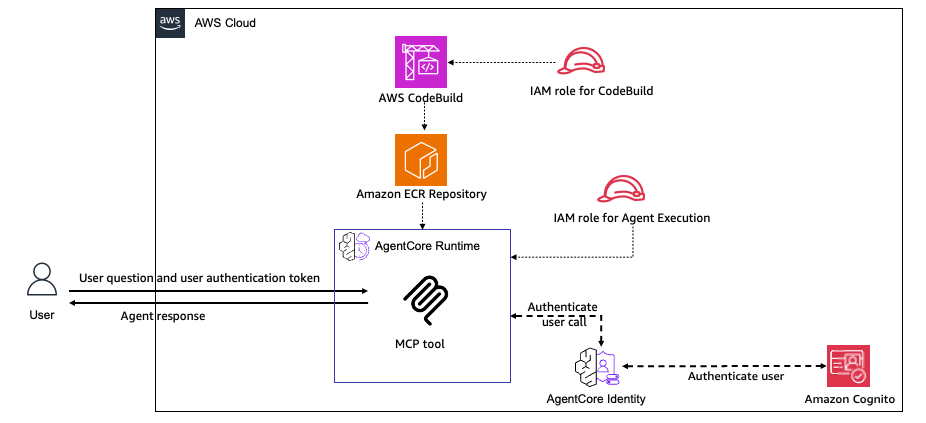

# Hosting MCP Server on AgentCore Runtime - Pulumi

## Overview

This Pulumi stack deploys an MCP (Model Context Protocol) server on Amazon Bedrock AgentCore Runtime. It demonstrates how to host MCP tools on AgentCore Runtime using infrastructure as code, with the container image built and pushed automatically during deployment.

The stack uses the Amazon Bedrock AgentCore Python SDK to wrap agent functions as an MCP server compatible with Amazon Bedrock AgentCore. It handles the MCP server details so you can focus on your agent's core functionality.

When hosting tools, the Amazon Bedrock AgentCore Python SDK implements the [Stateless Streamable HTTP](https://modelcontextprotocol.io/specification/2025-06-18/basic/transports) transport protocol with the `MCP-Session-Id` header for session isolation. Your MCP server will be hosted on port `8000` and provide one invocation path: the `mcp-POST` endpoint.

The deployment flow follows the same pattern as the AWS CDK sample: CodeBuild is triggered from managed AWS infrastructure during the Pulumi deployment, not from local shell scripts.

### Tutorial Details

| Information         | Details                                           |
| :------------------ | :------------------------------------------------ |
| Tutorial type       | Hosting Tools                                     |
| Tool type           | MCP server                                        |
| Tutorial components | Pulumi, AgentCore Runtime, MCP server, Cognito    |
| Tutorial vertical   | Cross-vertical                                    |
| Example complexity  | Intermediate                                      |
| SDK used            | Amazon BedrockAgentCore Python SDK and MCP Client |

### Key Features

- **Complete Infrastructure as Code** - Full Pulumi TypeScript implementation
- **Secure by Default** - JWT authentication with Cognito
- **Automated Build** - CodeBuild creates ARM64 Docker images during deployment
- **Easy Testing** - Automated test script included
- **Simple Cleanup** - One command removes all resources
- **Secrets Management** - Test password stored as a Pulumi secret
- **ESC Integration** - Supports Pulumi ESC with AWS OIDC for short-lived credentials

## Architecture



This stack deploys an MCP server with three tools: `add_numbers`, `multiply_numbers`, and `greet_user`.

The architecture consists of:

- **User/MCP Client**: Sends requests to the MCP server with JWT authentication
- **Amazon Cognito**: Provides JWT-based authentication
  - User Pool with pre-created test user
  - User Pool Client for application access
- **AWS CodeBuild**: Builds the ARM64 Docker container image with the MCP server
- **Amazon ECR Repository**: Stores the container image
- **AgentCore Runtime**: Hosts the MCP Server
  - **MCP Server**: Exposes three tools via HTTP transport on port 8000
    - `add_numbers`: Adds two numbers
    - `multiply_numbers`: Multiplies two numbers
    - `greet_user`: Greets a user by name
  - Validates JWT tokens from Cognito
  - Processes MCP tool invocations
- **IAM Roles**:
  - IAM role for CodeBuild (builds and pushes images)
  - IAM role for AgentCore Runtime (runtime permissions)
  - IAM role for build-trigger Lambda (starts CodeBuild)
  - IAM role for password-setter Lambda (sets Cognito test user password)

## What Gets Deployed

The Pulumi stack creates:

- **S3 Bucket** - Stores MCP server source code for CodeBuild
- **Amazon ECR Repository** - Stores the MCP server Docker image
- **AWS CodeBuild Project** - Builds ARM64 Docker image automatically
- **Amazon Cognito User Pool** - JWT authentication
- **Cognito User Pool Client** - Application client configuration
- **Cognito User** - Pre-created test user with configurable password
- **IAM Roles** - Least-privilege permissions for all services
- **Lambda Functions** - Build trigger and Cognito password setter
- **Amazon Bedrock AgentCore Runtime** - Hosts the MCP server with JWT authorizer

**MCP Server Tools**:

- `add_numbers` - Adds two numbers together
- `multiply_numbers` - Multiplies two numbers
- `greet_user` - Greets a user by name

## Prerequisites

### Required Accounts and Access

1. AWS account with permission to create:
   - IAM roles and policies
   - S3 buckets and objects
   - ECR repositories
   - CodeBuild projects
   - Lambda functions
   - Cognito User Pools
   - Bedrock AgentCore runtimes
2. Access to Amazon Bedrock models in the target AWS region
3. A Pulumi account if you use the default Pulumi Cloud backend
   - Run `pulumi login`
   - If you use another backend, log in to that backend instead

### Required Tools

1. Pulumi CLI
2. Node.js 18 or later
3. npm
4. AWS CLI
5. Python 3.11 or later for the local test script

### Authentication

Pulumi supports multiple AWS authentication methods. See the AWS provider configuration docs for the supported options:

- https://www.pulumi.com/registry/packages/aws/installation-configuration/

The preferred option for this example is Pulumi ESC with AWS OIDC so Pulumi can use short-lived AWS credentials instead of long-lived local credentials:

- https://www.pulumi.com/docs/esc/environments/configuring-oidc/aws/
- https://www.pulumi.com/docs/esc/guides/configuring-oidc/aws/

If you use ESC, the stack must import an environment in the form `<esc-project>/<esc-environment>` that grants AWS access for the target account.

## Install

```bash
npm install
pulumi login
pulumi stack select dev || pulumi stack init dev
pulumi config env add <esc-project>/<esc-environment> -s dev --yes
```

The `pulumi config env add` command adds the ESC environment to the stack import list:

- https://www.pulumi.com/docs/iac/cli/commands/pulumi_config_env_add/

Set the AWS region if it is not supplied by your ESC environment:

```bash
pulumi config set aws:region us-east-1 -s dev
```

Set the test user password for Cognito JWT authentication (stored as a Pulumi secret).
Avoid special characters like `!` in the password value because shells may escape them before Pulumi receives the value:

```bash
pulumi config set --secret testPassword TestPassword123 -s dev
```

Optional stack settings:

```bash
pulumi config set agentName MCPServerAgent -s dev
pulumi config set stackName agentcore-mcp-server -s dev
pulumi config set imageTag latest -s dev
pulumi config set networkMode PUBLIC -s dev
```

## Deploy

Preview the resources that will be created:

```bash
pulumi preview -s dev
```

Deploy the stack:

```bash
pulumi up -s dev
```

Expected deployment flow:

1. Pulumi creates the S3, ECR, IAM, Cognito, Lambda, and CodeBuild resources.
2. Pulumi invokes the build-trigger Lambda.
3. The Lambda starts the CodeBuild project and waits for a successful image push.
4. Pulumi invokes the password-setter Lambda to configure the Cognito test user.
5. Pulumi creates or updates the AgentCore runtime with the built image and JWT authorizer.

Typical deployment time is about 8 to 12 minutes, with most of that in CodeBuild.

## Outputs

After deployment:

```bash
pulumi stack output -s dev
```

Important outputs:

| Output                    | Description                                 |
| ------------------------- | ------------------------------------------- |
| `agentRuntimeArn`         | ARN of the AgentCore runtime                |
| `agentRuntimeId`          | ID of the AgentCore runtime                 |
| `ecrRepositoryUrl`        | ECR repository URL for the MCP server image |
| `codebuildProjectName`    | Name of the CodeBuild project               |
| `cognitoUserPoolId`       | Cognito User Pool ID                        |
| `cognitoUserPoolClientId` | Cognito User Pool Client ID                 |
| `cognitoDiscoveryUrl`     | OIDC discovery URL for JWT validation       |
| `getTokenCommand`         | Ready-to-run command to get a JWT token     |

## Testing

### Install Test Dependencies

```bash
python3 -m venv .venv
source .venv/bin/activate
pip install boto3 mcp
```

### Step 1: Get Authentication Token

Get a JWT token from Cognito. Use the ESC environment to provide AWS credentials:

```bash
CLIENT_ID=$(pulumi stack output cognitoUserPoolClientId -s dev)
pulumi env run <esc-project>/<esc-environment> -- python get_token.py "$CLIENT_ID" testuser TestPassword123 us-east-1
```

Replace `TestPassword123` with the password you configured. Copy the JWT token from the output.

### Step 2: Test the MCP Server

```bash
RUNTIME_ARN=$(pulumi stack output agentRuntimeArn -s dev)
pulumi env run <esc-project>/<esc-environment> -- python test_mcp_server.py "$RUNTIME_ARN" YOUR_JWT_TOKEN
```

Replace `YOUR_JWT_TOKEN` with the token from step 1.

### Expected Output

```
Extracted region from ARN: us-east-1
Connecting to: https://bedrock-agentcore.us-east-1.amazonaws.com/runtimes/...

MCP session initialized
Tools: ['add_numbers', 'multiply_numbers', 'greet_user']
add_numbers(5, 3) = 8
multiply_numbers(4, 7) = 28
greet_user(Alice) = Hello, Alice! Nice to meet you.
All tests PASSED!
```

### Customization

Edit files in `mcp-server-code/` and redeploy to add or change tools:

```python
# mcp-server-code/mcp_server.py
@mcp.tool()
def subtract_numbers(a: int, b: int) -> int:
    """Subtract two numbers"""
    return a - b
```

Changes are automatically detected and trigger a rebuild on the next `pulumi up`.

## Cleanup

```bash
pulumi destroy -s dev
```

If you also want to remove the stack state:

```bash
pulumi stack rm dev
```

## Troubleshooting

### Authentication Issues

If JWT authentication fails:

- Verify the Cognito User Pool Client ID is correct
- Ensure you are using the correct AWS region
- Check that the test password matches what you configured with `pulumi config set --secret testPassword`
- Verify `USER_PASSWORD_AUTH` is enabled for the client (it is by default in this stack)
- If you see "Password attempts exceeded", Cognito has temporarily locked the account after too many failed attempts. Wait a few minutes or destroy and redeploy the stack to create a new user pool.

### Build Failures

Check CodeBuild logs in the AWS Console:

1. Go to the CodeBuild console
2. Find the build project (name contains `mcp-server-build`)
3. Check build history and logs

Common causes:

- Network connectivity issues during Docker image pull
- ECR authentication problems
- Python dependency conflicts in `mcp-server-code/requirements.txt`

### Runtime Creation Fails

If the AgentCore runtime fails to create:

1. Verify the Docker image exists in ECR
2. Check IAM role permissions
3. Verify Bedrock AgentCore service quotas in your region

### Permission Issues

Ensure your AWS credentials have permissions to create all resources in the stack, including `iam:PassRole` for service roles.

## Cost Estimate

### Monthly Cost Breakdown (us-east-1)

| Service               | Usage                                        | Monthly Cost |
| --------------------- | -------------------------------------------- | ------------ |
| **AgentCore Runtime** | 1 runtime, minimal usage                     | ~$5-10       |
| **ECR Repository**    | 1 repository, less than 1 GB storage         | ~$0.10       |
| **CodeBuild**         | Occasional builds                            | ~$1-2        |
| **Lambda**            | Build trigger and password setter executions | ~$0.01       |
| **Cognito User Pool** | 1 user pool, minimal usage                   | ~$0.01       |
| **S3**                | Source code archive                          | ~$0.01       |
| **CloudWatch Logs**   | Runtime and build logs                       | ~$0.50       |

**Estimated Total: ~$7-13/month**

### Cost Optimization

- **Delete when not in use**: Run `pulumi destroy -s dev` to remove all resources
- **Monitor usage**: Set up CloudWatch billing alarms
- **Rebuild only when needed**: CodeBuild only runs when source code or buildspec changes
