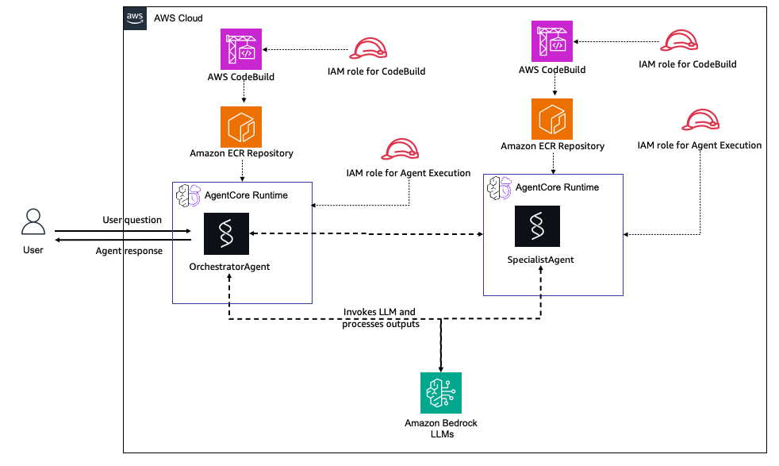

# Multi-Agent AgentCore Runtime - Pulumi

## Overview

This Pulumi stack deploys a multi-agent system on Amazon Bedrock AgentCore Runtime with Agent-to-Agent (A2A) communication. It demonstrates how an orchestrator agent can delegate complex tasks to a specialist agent, a pattern useful for building sophisticated AI systems with specialized capabilities.

Both agents use the [Strands](https://github.com/strands-agents/strands-agents-python) framework. The orchestrator agent has a `call_specialist_agent` tool that invokes the specialist agent's runtime via the `bedrock-agentcore:InvokeAgentRuntime` API.

The deployment flow follows the same pattern as the AWS CDK sample: CodeBuild is triggered from managed AWS infrastructure during the Pulumi deployment, not from local shell scripts.

### Tutorial Details

| Information         | Details                                           |
| :------------------ | :------------------------------------------------ |
| Tutorial type       | Multi-Agent with A2A Communication                |
| Tool type           | Strands Agent with Agent-to-Agent invocation      |
| Tutorial components | Pulumi, AgentCore Runtime (x2), A2A Communication |
| Tutorial vertical   | Cross-vertical                                    |
| Example complexity  | Intermediate                                      |
| SDK used            | Strands Agents, Amazon Bedrock AgentCore SDK      |

### Key Features

- **Agent-to-Agent Communication** - Orchestrator invokes Specialist via `InvokeAgentRuntime`
- **Automatic Orchestration** - Orchestrator decides when to delegate based on query complexity
- **Independent Deployment** - Each agent has its own ECR repository, build, and runtime
- **Complete Infrastructure as Code** - Full Pulumi TypeScript implementation
- **Automated Build** - CodeBuild creates ARM64 Docker images during deployment
- **Easy Testing** - Automated test script included
- **Simple Cleanup** - One command removes all resources
- **ESC Integration** - Supports Pulumi ESC with AWS OIDC for short-lived credentials

### Agent Roles

**Agent 1: Orchestrator Agent**

- Main entry point for user queries
- Handles simple queries directly
- Delegates complex analytical tasks to the Specialist
- Has a `call_specialist_agent` tool for A2A invocation

**Agent 2: Specialist Agent**

- Expert agent for detailed analysis
- Provides in-depth analytical responses
- Handles complex reasoning tasks
- Operates independently (can also be tested directly)

## Architecture



The architecture consists of:

- **User**: Sends questions to Agent 1 (Orchestrator) and receives responses
- **Agent 1 - Orchestrator Agent**:
  - **AWS CodeBuild**: Builds the ARM64 Docker container image for Agent 1
  - **Amazon ECR Repository**: Stores Agent 1's container image
  - **AgentCore Runtime**: Hosts the Orchestrator Agent
    - Routes simple queries directly
    - Delegates complex queries to Agent 2 using the `call_specialist_agent` tool
    - Invokes Amazon Bedrock LLMs for reasoning
  - **IAM Role**: Permissions to invoke Agent 2's runtime and access Bedrock
- **Agent 2 - Specialist Agent**:
  - **AWS CodeBuild**: Builds the ARM64 Docker container image for Agent 2
  - **Amazon ECR Repository**: Stores Agent 2's container image
  - **AgentCore Runtime**: Hosts the Specialist Agent
    - Provides detailed analysis and expert responses
    - Invokes Amazon Bedrock LLMs for in-depth reasoning
  - **IAM Role**: Standard runtime permissions and Bedrock access
- **Amazon Bedrock LLMs**: Provides AI model capabilities for both agents
- **Agent-to-Agent Communication**: Agent 1 invokes Agent 2's runtime via `bedrock-agentcore:InvokeAgentRuntime` API

## What Gets Deployed

The Pulumi stack creates:

- **S3 Buckets (x2)** - Source code storage for Orchestrator and Specialist
- **Amazon ECR Repositories (x2)** - Container images for each agent
- **AWS CodeBuild Projects (x2)** - ARM64 Docker image builds for each agent
- **Lambda Function** - Build trigger that starts CodeBuild and waits for completion
- **Amazon Bedrock AgentCore Runtimes (x2)** - Orchestrator and Specialist agents
- **IAM Roles** - Least-privilege permissions for AgentCore, CodeBuild, Lambda, and A2A communication

## Prerequisites

### Required Accounts and Access

1. AWS account with permission to create:
   - IAM roles and policies
   - S3 buckets and objects
   - ECR repositories
   - CodeBuild projects
   - Lambda functions
   - Bedrock AgentCore runtimes
2. Access to Amazon Bedrock models in the target AWS region
3. A Pulumi account if you use the default Pulumi Cloud backend
   - Run `pulumi login`
   - If you use another backend, log in to that backend instead

### Required Tools

1. Pulumi CLI
2. Node.js 18 or later
3. npm
4. AWS CLI
5. Python 3.11 or later for the local test script

### Authentication

Pulumi supports multiple AWS authentication methods. See the AWS provider configuration docs for the supported options:

- https://www.pulumi.com/registry/packages/aws/installation-configuration/

The preferred option for this example is Pulumi ESC with AWS OIDC so Pulumi can use short-lived AWS credentials instead of long-lived local credentials:

- https://www.pulumi.com/docs/esc/environments/configuring-oidc/aws/
- https://www.pulumi.com/docs/esc/guides/configuring-oidc/aws/

If you use ESC, the stack must import an environment in the form `<esc-project>/<esc-environment>` that grants AWS access for the target account.

## Install

```bash
npm install
pulumi login
pulumi stack select dev || pulumi stack init dev
pulumi config env add <esc-project>/<esc-environment> -s dev --yes
```

The `pulumi config env add` command adds the ESC environment to the stack import list:

- https://www.pulumi.com/docs/iac/cli/commands/pulumi_config_env_add/

Set the AWS region if it is not supplied by your ESC environment:

```bash
pulumi config set aws:region us-east-1 -s dev
```

Optional stack settings:

```bash
pulumi config set orchestratorName OrchestratorAgent -s dev
pulumi config set specialistName SpecialistAgent -s dev
pulumi config set stackName agentcore-multi-agent -s dev
pulumi config set imageTag latest -s dev
pulumi config set networkMode PUBLIC -s dev
```

## Deploy

Preview the resources that will be created:

```bash
pulumi preview -s dev
```

Deploy the stack:

```bash
pulumi up -s dev
```

Expected deployment flow:

1. Pulumi creates the S3, ECR, IAM, Lambda, and CodeBuild resources.
2. Pulumi invokes the build-trigger Lambda for the Specialist agent first.
3. The Lambda starts the Specialist CodeBuild project and waits for a successful image push.
4. Pulumi invokes the build-trigger Lambda for the Orchestrator agent.
5. The Lambda starts the Orchestrator CodeBuild project and waits for a successful image push.
6. Pulumi creates the Specialist AgentCore runtime.
7. Pulumi creates the Orchestrator AgentCore runtime with the Specialist ARN as an environment variable.

Typical deployment time is about 15 to 20 minutes, with most of that in the two sequential CodeBuild runs.

## Outputs

After deployment:

```bash
pulumi stack output -s dev
```

Important outputs:

| Output                             | Description                                   |
| ---------------------------------- | --------------------------------------------- |
| `orchestratorRuntimeArn`           | ARN of the Orchestrator AgentCore runtime     |
| `orchestratorRuntimeId`            | ID of the Orchestrator AgentCore runtime      |
| `specialistRuntimeArn`             | ARN of the Specialist AgentCore runtime       |
| `specialistRuntimeId`              | ID of the Specialist AgentCore runtime        |
| `orchestratorEcrRepositoryUrl`     | ECR repository URL for the Orchestrator image |
| `specialistEcrRepositoryUrl`       | ECR repository URL for the Specialist image   |
| `orchestratorCodebuildProjectName` | Name of the Orchestrator CodeBuild project    |
| `specialistCodebuildProjectName`   | Name of the Specialist CodeBuild project      |
| `testScriptCommand`                | Ready-to-run command to test the agents       |

## Testing

### Install Test Dependencies

```bash
python3 -m venv .venv
source .venv/bin/activate
pip install boto3
```

### Run the Test Script

```bash
python test_multi_agent.py "$(pulumi stack output orchestratorRuntimeArn -s dev)"
```

If you use Pulumi ESC for AWS credentials:

```bash
ORCH_ARN=$(pulumi stack output orchestratorRuntimeArn -s dev)
pulumi env run <esc-project>/<esc-environment> -- python test_multi_agent.py "$ORCH_ARN"
```

### Invoke Directly with AWS CLI

```bash
# Test Orchestrator (simple query - handled directly)
ORCH_ARN=$(pulumi stack output orchestratorRuntimeArn -s dev)

aws bedrock-agentcore invoke-agent-runtime \
  --agent-runtime-arn "$ORCH_ARN" \
  --qualifier DEFAULT \
  --payload "$(echo '{"prompt":"Hello, how are you?"}' | base64)" \
  response.json

cat response.json
```

```bash
# Test Orchestrator (complex query - delegates to Specialist)
aws bedrock-agentcore invoke-agent-runtime \
  --agent-runtime-arn "$ORCH_ARN" \
  --qualifier DEFAULT \
  --payload "$(echo '{"prompt":"Provide a detailed analysis of the benefits and drawbacks of serverless architecture"}' | base64)" \
  response.json
```

```bash
# Test Specialist directly
SPEC_ARN=$(pulumi stack output specialistRuntimeArn -s dev)

aws bedrock-agentcore invoke-agent-runtime \
  --agent-runtime-arn "$SPEC_ARN" \
  --qualifier DEFAULT \
  --payload "$(echo '{"prompt":"Explain quantum computing in detail"}' | base64)" \
  response.json
```

### Sample Queries

**Queries that the Orchestrator handles directly** (simple):

| Query                 | Description     |
| :-------------------- | :-------------- |
| `Hello, how are you?` | Simple greeting |
| `What is 5 + 3?`      | Simple math     |

**Queries that trigger A2A delegation** (complex):

| Query                                                                                    | Description          |
| :--------------------------------------------------------------------------------------- | :------------------- |
| `Provide a detailed analysis of the benefits and drawbacks of serverless architecture`   | Detailed analysis    |
| `Explain the CAP theorem and its implications for distributed systems`                   | Expert knowledge     |
| `Compare and contrast different machine learning algorithms for time series forecasting` | Complex reasoning    |
| `Provide expert analysis on best practices for securing cloud infrastructure`            | In-depth explanation |

### Customization

Edit `agent-orchestrator-code/agent.py` to change the orchestrator behavior:

```python
# agent-orchestrator-code/agent.py - Modify the system prompt
system_prompt = """You are an orchestrator agent.
For simple questions, answer directly.
For complex analytical tasks, use call_specialist_agent."""
```

Edit `agent-specialist-code/agent.py` to change the specialist:

```python
# agent-specialist-code/agent.py - Add domain expertise
system_prompt = """You are a cybersecurity specialist.
Provide detailed security analysis and recommendations."""
```

To add more specialist agents, duplicate the specialist pattern in `index.ts` (S3 bucket, ECR repo, CodeBuild, runtime) and add a new tool to the orchestrator.

Changes are automatically detected and trigger a rebuild on the next `pulumi up`.

## Cleanup

Remove all resources:

```bash
pulumi destroy -s dev
```

If you also want to remove the stack state:

```bash
pulumi stack rm dev
```

## Troubleshooting

### Build Failures

Check CodeBuild logs in the AWS Console:

1. Go to the CodeBuild console
2. Find the build projects (names contain `orchestrator-build` and `specialist-build`)
3. Check build history and logs

Common causes:

- Network connectivity issues during Docker image pull
- ECR authentication problems
- Python dependency conflicts in agent `requirements.txt`

### Runtime Creation Fails

If an AgentCore runtime fails to create:

1. Verify the Docker image exists in ECR
2. Check IAM role permissions
3. Verify Bedrock AgentCore service quotas in your region

### Agent Communication Issues

If the Orchestrator cannot invoke the Specialist:

1. Check that the `SPECIALIST_ARN` environment variable is set on the Orchestrator runtime
2. Verify the Orchestrator's IAM role has `bedrock-agentcore:InvokeAgentRuntime` permission
3. Verify the Specialist runtime is running and healthy
4. Check CloudWatch logs for both agents

### Permission Issues

Ensure your AWS credentials have permissions to create all resources in the stack, including `iam:PassRole` for service roles.

## Cost Estimate

### Monthly Cost Breakdown (us-east-1)

| Service                | Usage                                  | Monthly Cost |
| ---------------------- | -------------------------------------- | ------------ |
| **AgentCore Runtimes** | 2 runtimes, minimal usage              | ~$10-20      |
| **ECR Repositories**   | 2 repositories, less than 2 GB storage | ~$0.20       |
| **CodeBuild**          | Occasional builds                      | ~$2-4        |
| **Lambda**             | Build trigger executions               | ~$0.01       |
| **S3**                 | Source code archives                   | ~$0.02       |
| **CloudWatch Logs**    | Agent logs                             | ~$1.00       |
| **Bedrock Model**      | Pay per token                          | Variable\*   |

**Estimated Total: ~$13-25/month** (excluding Bedrock model usage)

\*Bedrock costs depend on your usage patterns and chosen models. See [Bedrock Pricing](https://aws.amazon.com/bedrock/pricing/) for details.

### Cost Optimization

- **Delete when not in use**: Run `pulumi destroy -s dev` to remove all resources
- **Monitor usage**: Set up CloudWatch billing alarms
- **Choose efficient models**: Select appropriate Bedrock models for your use case
- **Rebuild only when needed**: CodeBuild only runs when source code or buildspec changes
