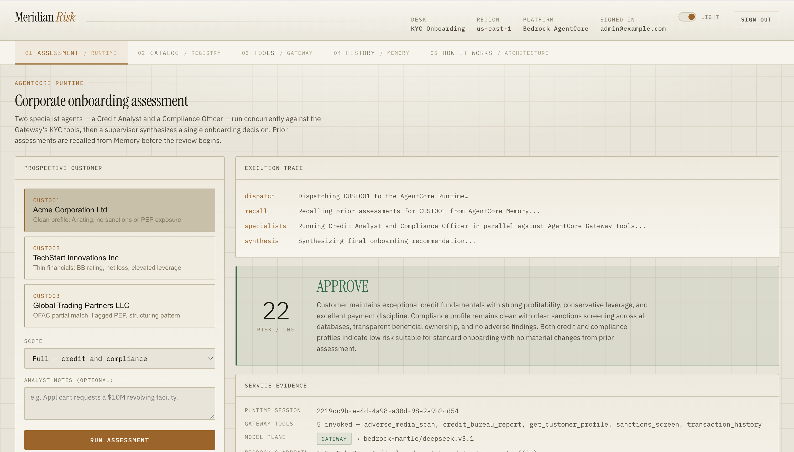
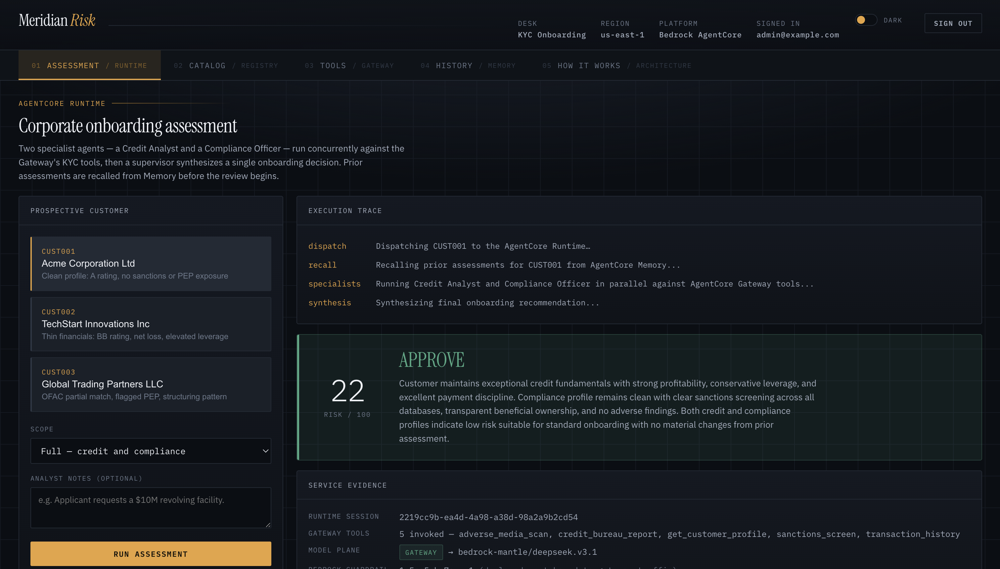
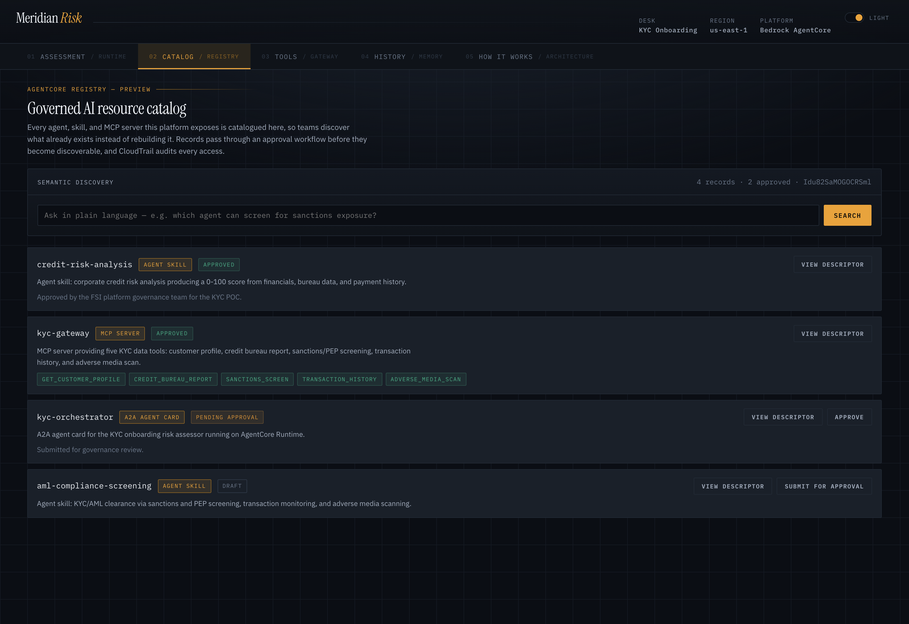
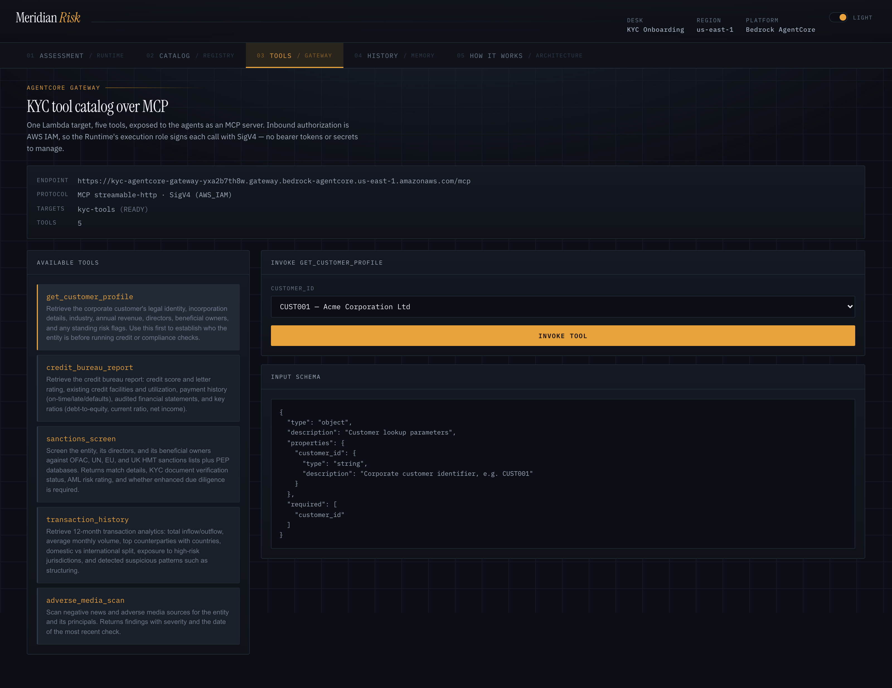
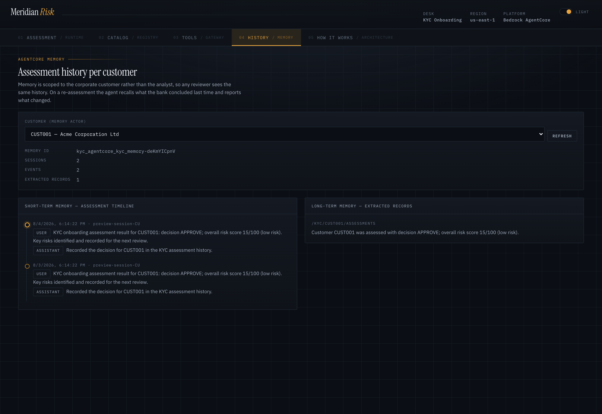
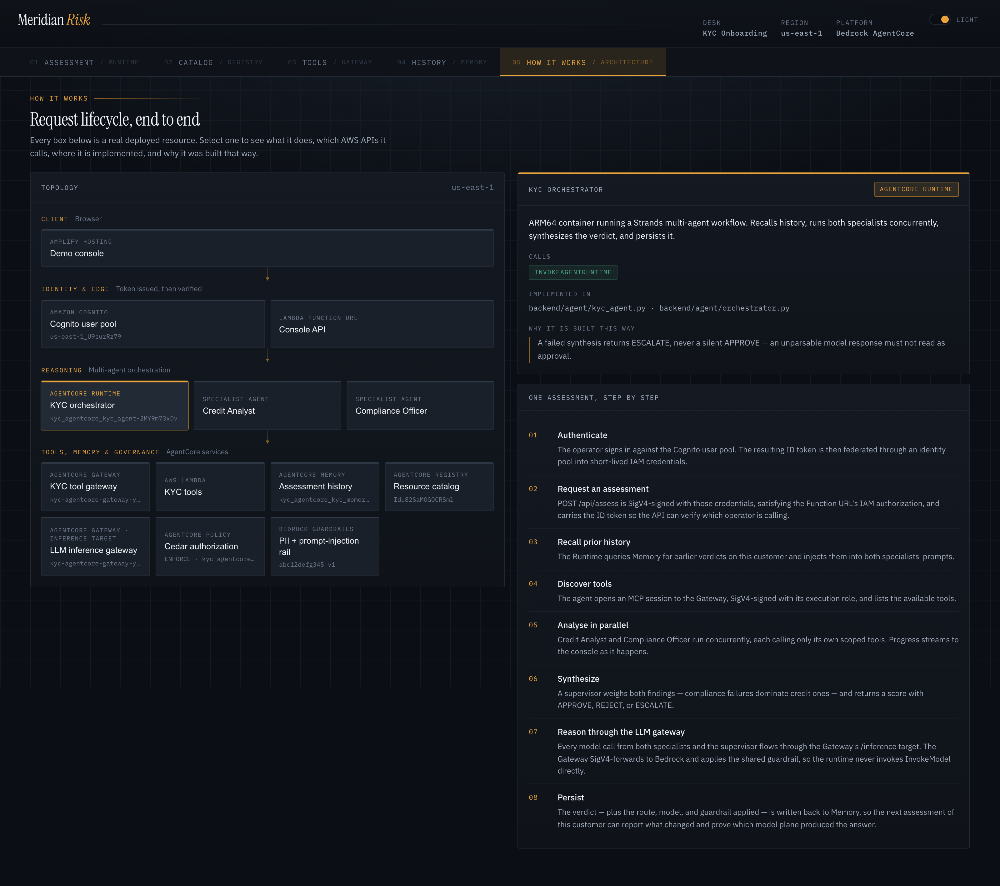
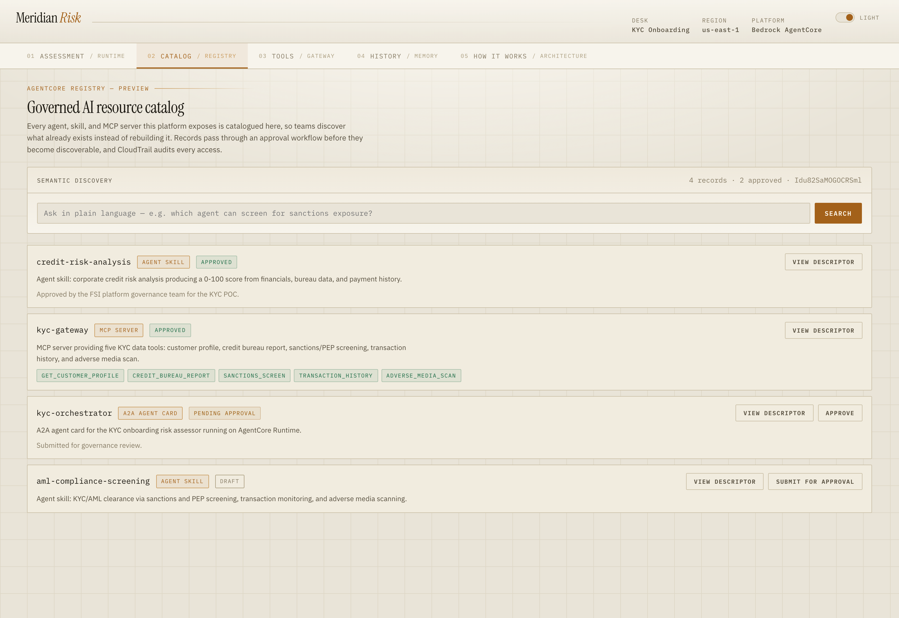
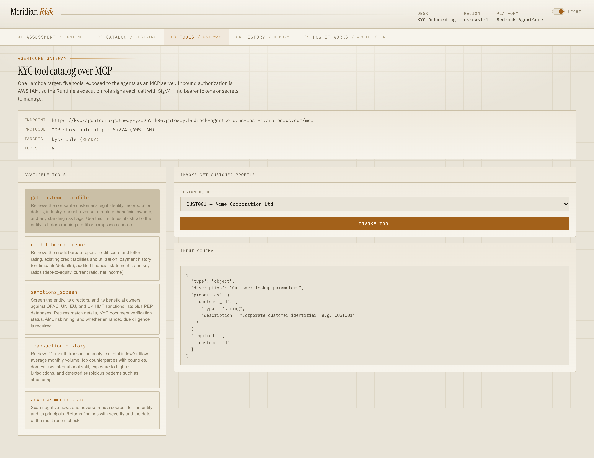
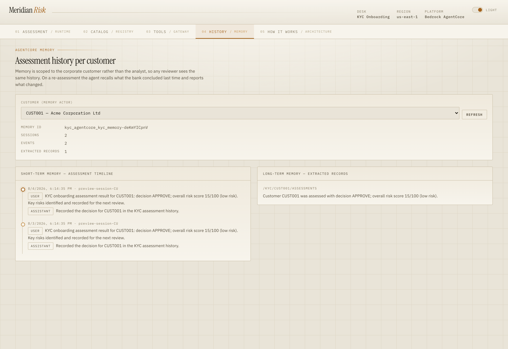
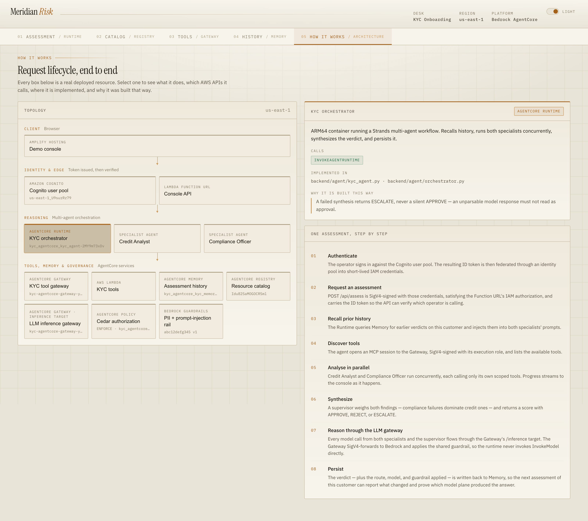

<div align="center">

# Governed Multi-Agent KYC with Amazon Bedrock AgentCore

**An end-to-end reference implementation on Amazon Bedrock AgentCore — Runtime, Gateway, Memory, Policy, and Agent Registry — where one gateway governs both the tool plane and the model plane.**

[](https://python.org)
[](https://aws.amazon.com/bedrock/agentcore/)
[](https://react.dev)
[](https://www.terraform.io)
[](LICENSE)

</div>

<div align="center">


</div>

---

## Overview

This is a working deployment built on **Amazon Bedrock AgentCore** — using five
of its modular services together (Runtime, Gateway, Memory, Policy, and Agent
Registry) to answer the question a platform team actually has: not *can an agent
call a tool*, but **can you prove it was only ever allowed to call that one**.

Corporate banking KYC onboarding is the vehicle — a Credit Analyst and a
Compliance Officer assess a prospective customer concurrently, and a supervisor
synthesizes one decision. The use case is realistic enough to make the
governance questions concrete, but the subject here is the platform mechanics.

| Service | How this solution uses it |
|---|---|
| **Agent Registry** (preview) | Governed catalog of the platform's agent card, MCP server, and agent skills, with an approval workflow and semantic discovery. Records are generated from the same objects the agents run on. |
| **AgentCore Gateway** — MCP target | Five KYC data tools exposed to the agents over MCP, authorized with AWS IAM (SigV4), signed per request. |
| **AgentCore Gateway** — inference target | The same gateway fronts **model invocation** through a Bedrock Mantle connector on `/inference`. Agents call it instead of Bedrock, so credentials, cost attribution, and audit have one control point. |
| **AgentCore Policy** | Cedar policies evaluated server-side on every gateway request in `ENFORCE` mode. A denied tool call is refused before the tool Lambda runs. |
| **AgentCore Runtime** | ARM64 container running a Strands multi-agent workflow: two specialists in parallel, then synthesis. Progress streams over SSE. |
| **AgentCore Harness** | The same KYC assistant as a *managed* agent loop — model, prompt, and the shared Gateway declared as config — the declarative counterpart to the code-defined Runtime. |
| **AgentCore Memory** | Assessment history keyed per corporate customer, so a re-assessment reports what changed rather than starting cold. |
| **AgentCore Observability** | The Runtime is instrumented with ADOT (OpenTelemetry); traces, spans, and prompts land in CloudWatch (Transaction Search) so an assessment's tool calls and model turns are auditable end to end. |

## Contents

| Section | |
|---|---|
| [Architecture](#architecture) | Topology and the eight-step request lifecycle |
| [The demo narrative](#the-demo-narrative) | Three applicants, three genuinely different outcomes |
| [The console](#the-console) | Every view, in both themes |
| [Deploy](#deploy) | One command from a fresh clone to a signed-in console |
| [OAuth flows](#oauth-flows-optional) | Discover, invoke, and auto-populate the Registry over OAuth (optional) |
| [Repo layout](#repo-layout) | Where things live |

### Additional documentation

| Doc | Contents |
|---|---|
| [docs/platform-mechanics.md](docs/platform-mechanics.md) | **The five AgentCore services in depth, plus the design decisions** — how the Gateway fronts both planes, how Policy enforces, where the guardrail binding stands. Kept out of this README because the preview-API specifics move fast. |
| [docs/preview-api-notes.md](docs/preview-api-notes.md) | **~40 practical notes and constraints met while building against the preview APIs**, grouped by service. The most useful page here if you are building on AgentCore today. |
| [docs/deployment.md](docs/deployment.md) | Configuration reference, teardown, and the hosted-console gotchas (Function URL streaming, browser SigV4, CORS). |
| [docs/console.md](docs/console.md) | Every view in both themes, and how the screenshots are regenerated. |

---

## Architecture

<div align="center">

</div>

### Request lifecycle

| Step | What happens |
|---|---|
| 1 | The operator signs in against the Cognito user pool. The ID token is federated through an identity pool into short-lived IAM credentials. |
| 2 | `POST /api/assess` is SigV4-signed with those credentials, satisfying the Function URL's IAM authorization, and carries the ID token so the API can verify *which* operator is calling. |
| 3 | The Runtime queries Memory for earlier verdicts on this customer and injects them into both specialists' prompts. |
| 4 | The agent opens an MCP session to the Gateway, SigV4-signed with its execution role, and lists the available tools — following the pagination cursor. |
| 5 | Credit Analyst and Compliance Officer run concurrently, each calling only its own scoped tools. |
| 6 | A supervisor weighs both findings — compliance failures dominate credit ones — and returns a score with APPROVE, REJECT, or ESCALATE. |
| 7 | Every model call from both specialists and the supervisor flows through the Gateway's `/inference` target, so the runtime never invokes `InvokeModel` directly. |
| 8 | The verdict — plus the route, model, and guardrail on record — is written back to Memory. |

---

## The demo narrative

Three synthetic corporate applicants produce three genuinely different outcomes.

| Customer | Profile | Outcome |
|---|---|---|
| **CUST001** Acme Corporation Ltd | A rating, clean screening | **APPROVE** — risk 15/100 |
| **CUST002** TechStart Innovations Inc | BB rating, net loss, elevated leverage | **APPROVE with conditions** — risk 58/100 |
| **CUST003** Global Trading Partners LLC | OFAC partial match, flagged PEP, structuring pattern | **REJECT** — risk 98/100 |

CUST003 is the compelling case. The Compliance Officer detects the OFAC partial
match, the PEP beneficial owner, and 15 transactions at exactly $99,999 — then
cites 31 USC 5324 and FATF Recommendation 12 and flags a mandatory SAR
obligation. Run it twice and the agent recalls the prior verdict from Memory and
reports that no disqualifying violation has been resolved.

## The console

Five tabs, one per service plus a walkthrough of the request lifecycle. The
**Service evidence** panel after each run reports the model plane, the guardrail,
and how many tool calls the Gateway authorized — all read back from the run.

| Catalog — AgentCore Registry | Tools — AgentCore Gateway |
|---|---|
|  |  |
| Browse and semantically search the catalog; drive records `DRAFT → PENDING_APPROVAL → APPROVED`. | The five KYC tools with their JSON Schemas, and both gateway targets labelled by kind. |

| History — AgentCore Memory | How it works — request lifecycle |
|---|---|
|  |  |
| Short-term events and extracted long-term records, keyed per customer. | Clickable topology with live resource IDs, plus an eight-step trace of one assessment. |

<details>
<summary><b>Light theme</b></summary>

| Catalog | Tools |
|---|---|
|  |  |

| History | How it works |
|---|---|
|  |  |

</details>

---

## Deploy

**Prerequisites:** Terraform ≥ 1.5, a running container engine (**Docker or
Finch**), Python 3.13, Node 18+, and AWS credentials for an account with Amazon
Bedrock model access in a Registry-preview Region (`us-east-1`, `us-west-2`,
`ap-northeast-1`, `ap-southeast-2`, `eu-west-1`). `deploy.sh` uses whichever
engine is running (Docker first); force one with `CONTAINER_CLI=docker|finch`.

Two things must be true before you start:

1. **AWS credentials in `.env`** (gitignored):

   ```bash
   cat > .env <<'ENV'
   AWS_REGION=us-east-1
   AWS_ACCESS_KEY_ID=...
   AWS_SECRET_ACCESS_KEY=...
   ENV
   ```

2. **A console login address** in `infra/terraform.tfvars` — without it the
   stack deploys but creates no user, so you cannot sign in:

   ```bash
   cp infra/terraform.tfvars.example infra/terraform.tfvars
   # then set:  console_user_email = "you@example.com"
   ```

Then deploy everything with one command:

```bash
./scripts/deploy.sh
```

When it finishes it prints:

```
URL       https://…               # the hosted console
Username  you@example.com
Password  …                        # generated unless you set console_user_password
```

<details>
<summary><b>Prefer to run the steps yourself?</b></summary>

`deploy.sh` is a thin wrapper over these; run them directly to see each stage.

```bash
./scripts/bootstrap.sh                              # .venv + frontend deps (boto3 >= 1.42)
set -a && source .env && set +a && unset AWS_PROFILE
terraform -chdir=infra init
terraform -chdir=infra apply                        # re-run once if the gateway target errors
terraform -chdir=infra output -raw console_url
terraform -chdir=infra output -raw console_username
terraform -chdir=infra output -raw console_password
```

Run the console locally against the deployed backend instead of the hosted one:

```bash
python3 scripts/write_env.py       # writes .env.deploy + frontend/.env.local
AUTH_DISABLED=1 ./scripts/dev.sh   # http://localhost:5173, auth bypassed
```

</details>

> **Account entitlement — the one gate that fails late.** AgentCore Registry is a
> preview service that requires **per-account enrollment**. A brand-new account,
> even one with `AdministratorAccess`, gets
> `AccessDeniedException: not authorized to perform bedrock-agentcore:CreateRegistry`
> until it is allowlisted — and the apply would otherwise fail at `CreateRegistry`
> after provisioning most of the stack. `deploy.sh` checks this up front. Confirm
> manually with `aws bedrock-agentcore-control list-registries --region us-east-1`;
> if it errors instead of returning JSON, request preview access from AWS first.
> Gateway, Memory, and Policy have no such gate.

> **Model access.** The default `gateway_model_id` is DeepSeek, which is openly
> available on any account, so the gateway path works out of the box. The newer
> Claude models on the `bedrock-mantle` connector (sonnet-5, opus, haiku-4.5)
> are per-account entitlements granted through AWS Sales — an unentitled account
> gets `403 "not available for this account"`, which no console setting or IAM
> change clears. To demo Claude on an entitled account, set `gateway_model_id`
> to a Claude id; on an account without connector entitlement, set
> `inference_route = "direct"` to invoke Claude through a standard Bedrock
> inference profile instead (bypassing the gateway for model calls).

### Configuration

Set any of these in `infra/terraform.tfvars`:

| Variable | Default | Purpose |
|---|---|---|
| `console_user_email` | — | **Required.** The console login; becomes the Cognito username. |
| `inference_route` | `gateway` | `gateway` routes model calls through the Gateway; `direct` calls Bedrock. |
| `gateway_model_id` | `bedrock-mantle/deepseek.v3.1` | Model id as the connector advertises it. DeepSeek by default because it is openly available on any account; newer Claude models on the connector are per-account entitlements (see above). |
| `policy_engine_mode` | `ENFORCE` | `ENFORCE` denies violations; `LOG_ONLY` evaluates and logs. Use `LOG_ONLY` when widening a policy. |
| `enable_guardrail_binding_policy` | `false` | Binds the guardrail to gateway traffic via a Cedar `when guardrails` policy. Left off until that preview Cedar extension ships — see [docs/platform-mechanics.md](docs/platform-mechanics.md#binding-the-bedrock-guardrail). |
| `registry_auto_approval` | `false` | Left off so the approval workflow is demonstrable. |
| `enable_registry_oauth_demo` | `false` | Adds the optional OAuth flows (see [OAuth flows](#oauth-flows-optional)) — a JWT-authorized twin runtime, gateway, and registry, all gated. |

## OAuth flows (optional)

Beyond the base stack — which authorizes the Gateway with AWS IAM (SigV4) — the
repo includes an **optional, OAuth-authenticated** slice: the "discover, govern,
and reuse over OAuth" story from AWS's Agent Registry Show & Tell. It reuses the
same KYC tools and agent, and is gated behind `enable_registry_oauth_demo`
(default **off**), so the base deployment is untouched:

```bash
terraform -chdir=infra apply -var enable_registry_oauth_demo=true
# or: TF_VAR_enable_registry_oauth_demo=true ./scripts/deploy.sh
```

Three flows, each with a runnable, self-verifying script (`200` with a valid
token, `401`/`403` without):

| Flow | What it shows | Trace it in |
|---|---|---|
| **Auto-populate (URL sync)** | The Registry calls an OAuth-protected MCP gateway (client-credentials) and auto-discovers its tools into a record — no hand-authored tool list. | `scripts/seed_sync_record.py` (`build_spec()`), `infra/registry_oauth_sync.tf` |
| **Discover → invoke** | A consumer finds an agent in the Registry, mints an M2M OAuth token via AgentCore Identity, and calls it directly with a bearer token — no SigV4 on the agent call. | `scripts/discover_and_invoke_via_oauth.py`, `infra/registry_oauth_demo.tf` |
| **OAuth discovery** | A JWT/OAuth-authorized Registry whose *search* is done with a bearer token rather than IAM. | `scripts/discover_via_oauth_registry.py`, `infra/registry_oauth_discovery.tf` |

The OAuth credential provider references a **customer-owned Secrets Manager
secret** (`scripts/manage_oauth_provider.py`). The grant is machine-to-machine
(client-credentials) — service identity, not an end-user identity — and needs the
same Registry preview entitlement as the base stack. Preview-specific behaviors
(the `GetResourceOauth2Token` IAM chain, raw-bearer runtime invocation, the
JWT-registry search endpoint) are documented in
[docs/preview-api-notes.md](docs/preview-api-notes.md).

## Repo layout

```
backend/                    everything that runs on AWS compute
  agent/                      AgentCore Runtime container
    kyc_agent.py                entrypoint — streams progress
    orchestrator.py             runs specialists in parallel, synthesizes
    agents/skill.py             Skill dataclass per specialist
    agents/*.py                 each specialist's prompt + tools
    lib/gateway.py              MCP client, per-request SigV4
    lib/inference.py            direct-vs-gateway model selection
    lib/memory.py               assessment history read/write
  api/                        console API — one router per service
    main.py                     app, CORS, auth wiring
    aws.py                      shared boto3 clients + IDs
    auth.py                     Cognito ID-token validation
    routers_runtime.py          POST /api/assess (streams)
    routers_registry.py         browse + govern the catalog
    routers_gateway.py          inspect + invoke MCP tools
    routers_memory.py           assessment timeline
    routers_config.py           deployment IDs for the UI
  gateway/                    the Gateway's Lambda target
    kyc_tools_lambda.py         the five KYC tools
    tool_spec.json              tool contract (Terraform + Registry)
  harness/                    AgentCore Harness runtime assets
    skills/kyc-onboarding-assessment/SKILL.md   KYC method as a skill

data/                       synthetic customers (CUST001–003)

frontend/                   React demo console
  src/lib/                    api client, auth, SigV4 signer
  src/components/             one view per service
  preview.html · preview/     mocked-API harness — no AWS

infra/                      Terraform
  gateway.tf                  gateway, tool + inference targets
  policy.tf                   policy engine + Cedar (guardrail gated)
  guardrail.tf                Bedrock Guardrail
  harness.tf                  managed agent loop + S3 skill
  runtime.tf · memory.tf · registry.tf       AgentCore services
  cognito.tf · console_api.tf · amplify.tf   console frontend + API
  registry_oauth_demo.tf · registry_oauth_sync.tf · registry_oauth_discovery.tf   optional OAuth flows (gated)
  modules/ecr-image/          ECR + build/push, shared by both

scripts/                    bootstrap, deploy, Registry seed/purge, OAuth demo (seed + consumers)
docs/                       reference documentation + diagram
```

## Tech stack

| Layer | |
|---|---|
| Frontend | React 18, Vite 6, TypeScript 5 |
| Agent runtime | Python 3.13, Strands Agents SDK, ARM64 container on AgentCore Runtime |
| Console API | FastAPI, AWS Lambda Function URL with response streaming (Lambda Web Adapter) |
| AI | Amazon Bedrock AgentCore (Runtime, Gateway, Memory, Policy, Agent Registry), Amazon Bedrock Guardrails |
| Data | Synthetic corporate-customer fixtures (JSON) |
| Infrastructure | Terraform, AWS Lambda, Amazon Cognito, Amazon ECR, AWS Amplify Hosting, Amazon CloudWatch |

---

*This is a sample reference implementation for demonstration and learning, not a
production KYC system, and it is provided as-is under the MIT-0 license. It uses
synthetic customer data only. Several AgentCore capabilities used here are in
preview and subject to change. Before adapting any of this for a real workload,
apply your own security review, model validation, data-retention controls, and
regulatory sign-off — you are responsible for your use of the services and
models it invokes.*
