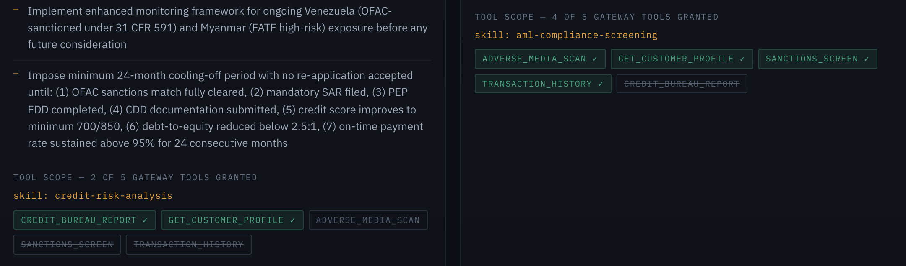

# The console

Five tabs, one per AgentCore service plus a walkthrough of the request
lifecycle. Screenshots are shown in the dark theme; each has a light version
behind a toggle. The theme switch lives in the top-right of the application
itself.

## Catalog — AgentCore Registry

Browse and semantically search the governed catalog; drive records
`DRAFT → PENDING_APPROVAL → APPROVED`.


<details><summary>Light theme</summary>


</details>

## Tools — AgentCore Gateway

The five KYC tools with their JSON Schemas, and the gateway's targets labelled
by kind — a tool target and a model target on one endpoint. Any tool can be
invoked directly.


<details><summary>Light theme</summary>


</details>

## History — AgentCore Memory

Short-term events and extracted long-term records, keyed per corporate
customer.


<details><summary>Light theme</summary>


</details>

## How it works — request lifecycle

A clickable topology with live resource IDs from the running stack, alongside an
eight-step trace of a single assessment. Selecting a node reveals what it does,
which AWS APIs it calls, which source file implements it, and the design
decision behind it.


<details><summary>Light theme</summary>


</details>

## Seeing the skills take effect

A demo that only *claims* its agent skills matter is not worth much, so each
specialist panel shows its own tool scope as observed at runtime.



Both specialists connect to the same Gateway with the same credentials. The only
reason the Credit Analyst never calls `sanctions_screen` is that its skill does
not list it, so the orchestrator never handed it over — shown struck through.
A green check means granted *and* invoked on this run.

None of those values are restated constants. The granted list is read back off
the tool objects actually passed to the agent, the withheld set is computed as
advertised-minus-granted, and the invoked set comes from the agent's own message
trace. If the skills were inert, every panel would show all five tools.

Two further signals in the same output: the specialists return *different JSON
shapes* (`score`/`level`/`factors` versus `status`/`checks_failed`/`edd_required`),
which come from the response contracts in their respective prompts; and only the
Compliance Officer cites 31 CFR 1020.320 and FATF Recommendation 12, rules
written into its prompt and absent from the other.

## Regenerating the screenshots

```bash
.venv/bin/python scripts/capture_screenshots.py
```

Runs the real console against the mocked API in `frontend/preview/` under
headless Chrome and writes both themes for every view. No AWS account, no
deployed stack, and no login are needed, so the images stay reproducible rather
than being one person's window captures.

## Palette preview

`frontend/preview.html` mounts the same harness with a palette switcher, so
theme and layout changes can be judged on the real UI.

```bash
cd frontend && npx vite    # then open /preview.html
```
