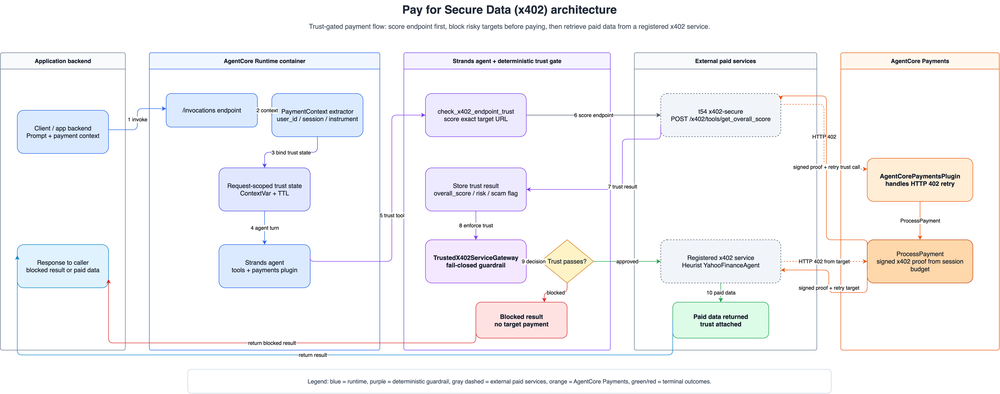

# Pay for Secure Data (x402)

## Overview

This sample demonstrates a trust-gated x402 paid-service flow with **Amazon Bedrock AgentCore Payments** and **t54 x402-secure**. A Strands agent first calls t54's x402-secure direct API for endpoint risk scoring, with `AgentCorePaymentsPlugin` handling the HTTP 402 payment flow. Only if the score clears the configured guardrail does the runtime call a registered target x402 service and return the paid content to the caller. The included registered service is Heurist YahooFinanceAgent market data, but the tool pattern is generic.

The agent runtime is designed not to hold wallet private keys or long-lived payment credentials. The application supplies `user_id`, `payment_session_id`, and `payment_instrument_id` per invocation, while the runtime uses a payment execution role to call `ProcessPayment` inside the session budget.

## Highlights

- Pre-payment t54 x402-secure trust checks for endpoint quality, risk, and scam signals
- `AgentCorePaymentsPlugin` handles HTTP 402 payment retry for both the trust check and target data call
- Deterministic tool guardrail enforces the trust decision before target payment
- AgentCore Payments proof generation instead of local private-key signing
- IAM role separation between control-plane setup, session management, and payment execution
- Per-invocation payment context for AgentCore Runtime deployments
- Local mocked unit tests plus optional AWS/x402 prerequisite gates
- No web demo, raw private service models, credentials, or generated payment artifacts included

## Use Case Details

| Information | Details |
|:------------|:--------|
| Use case type | Trust-gated paid x402 service access with autonomous micropayment |
| AgentCore components | Amazon Bedrock AgentCore Payments, AgentCore Runtime |
| Agent framework | Strands Agents |
| Payment protocol | x402 (HTTP 402 Payment Required) |
| Guardrail service | t54 x402-secure direct API |
| Included target service | Heurist YahooFinanceAgent x402 endpoint |
| Wallet type | Embedded crypto wallet through AgentCore Payments |
| Example complexity | Intermediate |

## Architecture

<div style="text-align:left">
    
</div>

**Numbered flow (matches the diagram)**

1. The application invokes AgentCore Runtime with a prompt plus `user_id`, `payment_session_id`, and `payment_instrument_id`.
2. The runtime extracts the payment context, creates request-scoped trust state, and starts the Strands agent turn.
3. The agent calls `check_x402_endpoint_trust` against the exact registered target endpoint URL.
4. t54 x402-secure returns HTTP 402 when payment is required; `AgentCorePaymentsPlugin` calls AgentCore Payments `ProcessPayment`, attaches the signed x402 proof, and retries the trust check.
5. The successful trust response is stored in request-scoped state.
6. `TrustedX402ServiceGateway` validates the requested `service_id`, `operation`, payload, and cached trust result before any target service payment.
7. If trust is missing, stale, low-score, scam-flagged, or URL-mismatched, the tool returns a blocked result and no target payment starts.
8. If trust passes, the gateway calls the registered target x402 service.
9. The target service can also return HTTP 402; the same payments plugin calls `ProcessPayment`, attaches the signed proof, and retries.
10. Paid data is returned to the application with the trust result attached.

The management role creates payment sessions and instruments. The runtime payment role only processes payments. Session budgets and payment instrument scope are enforced by AgentCore Payments rather than by agent prompt instructions. t54 x402-secure supplies the pre-payment trust signal; `call_trusted_x402_service` enforces the trust decision in code before a target x402 payment can start. The agent prompt instructs the order, but the registered service tool blocks missing, expired, low-score, scam, or URL-mismatched trust state deterministically.

## Payment Flow

When the agent needs a registered paid x402 service:

1. The application invokes AgentCore Runtime with a prompt and per-invocation payment context.
2. The trusted service tool validates the requested `service_id`, `operation`, and required payload fields.
3. The agent calls `check_x402_endpoint_trust`, which POSTs to t54 x402-secure `POST /x402/tools/get_overall_score` with the exact registered target endpoint URL.
4. t54 x402-secure returns HTTP 402; `AgentCorePaymentsPlugin` calls AgentCore Payments for a proof and retries the same tool with the x402 payment header.
5. A successful trust result is stored in request-scoped state and evaluated with `overall_score`, `risk_level`, `is_scam`, and `scam_indicators`.
6. If the endpoint is blocked, `call_trusted_x402_service` returns a blocked result and does not call the target service endpoint.
7. If the endpoint is approved, `call_trusted_x402_service` calls the registered target x402 endpoint; `AgentCorePaymentsPlugin` handles that second HTTP 402 payment retry.

## Layout

```text
pay-for-x402-secure-data/
├── README.md
├── .env.example
├── pay-for-x402-secure-data.ipynb
├── agent/                  # AgentCore Runtime FastAPI service and agent logic
├── setup/                  # public-safe AgentCore Payments setup helpers
└── test/                   # local unit tests and optional integration tests
```

## Prerequisites

- AWS account with Amazon Bedrock AgentCore Payments available in your target region
- AWS credentials configured for the setup and runtime roles
- Python 3.10+
- Docker, if building the AgentCore Runtime container locally
- Coinbase CDP credentials for the setup path (create the payment manager, connector, and instrument)
- The **current** AgentCore Payments private-beta service models installed into `~/.aws/models` (see [setup/README.md](setup/README.md)). These APIs are not in the public AWS SDK/CLI, and an outdated model fails on the `EMBEDDED_CRYPTO_WALLET` instrument type the live API now requires.
- An `EMBEDDED_CRYPTO_WALLET` payment instrument linked to a **real, deliverable email** (see [setup/README.md](setup/README.md)), funded with **USDC on Base mainnet**, with **Delegated Signing** granted at **both** layers: the project policy (CDP Portal → Wallets → Non-custodial Wallet → Security, needs your account 2FA) and the per-wallet WalletHub grant (sign in with the linked email's one-time code). The t54 x402-secure trust check and the Heurist target endpoint each settle a small **real** USDC payment on Base mainnet, so an unfunded wallet — or one missing either delegation layer — cannot complete a paid call. Once both are granted, the agent signs each payment autonomously within the session budget (no per-payment approval).

## Configure

```bash
cp .env.example .env
```

Fill in the payment manager, role, session, instrument, Coinbase, and x402-secure values needed for the flows you run. Local unit tests do not require AWS credentials.

## Sample Prompts

Use these prompts after configuring a payment session and instrument. Live runs settle real USDC twice when the target is approved: once for the t54 x402-secure trust check and once for the registered target x402 service.

- `Check trust for heurist_yahoo_finance, then fetch a quote snapshot for AAPL.`
- `Score the registered Heurist YahooFinanceAgent endpoint and only fetch a quote snapshot for TSLA if the endpoint passes the guardrail.`
- `Check whether the registered x402 market-data service is safe to call. If it is blocked, explain the trust reason and do not pay the target service.`

## Local Verification

```bash
python3 -m venv .venv
source .venv/bin/activate
python -m pip install -U pip
python -m pip install -r agent/requirements.txt -r setup/requirements.txt pytest httpx nbformat

PYTHONPATH="$PWD/agent" python -m unittest discover -s test/unit -p 'test_*.py' -v
```

## AgentCore Runtime Deploy, Invoke, Observe

Use these steps only after reviewing IAM scope, creating payment resources, and confirming that you are intentionally running against funded test endpoints. The local unit tests and notebook mocks do not perform live paid requests.

1. Prepare payment resources with the setup helpers (install the current beta service model first — see [setup/README.md](setup/README.md)):

   ```bash
   bash setup/setup_roles.sh        # IAM roles
   bash setup/setup_manager.sh      # credential provider, payment manager, connector
   bash setup/setup_instrument.sh   # EMBEDDED_CRYPTO_WALLET instrument + payment session
   ```

   Then complete the one-time onboarding the instrument step prints — set `INSTRUMENT_EMAIL` to a **real** address first, then grant **Delegated Signing at both layers** (project policy under Wallets → Non-custodial Wallet → Security, and the per-wallet WalletHub grant) and fund the wallet with USDC. After that, the agent pays autonomously within the session budget — no per-payment approval.

2. Deploy with the **AgentCore CLI** (`@aws/agentcore`), the current CDK-based tool. (The Python `bedrock-agentcore-starter-toolkit` with `configure`/`launch` is deprecated — don't use it.)

   ```bash
   npm install -g @aws/agentcore     # requires Node.js 20+ and configured AWS credentials
   agentcore create                  # scaffold an AgentCore project, then add this sample's
                                      # agent as a BYO agent (agentcore add agent --type byo)
   agentcore deploy                  # build + deploy to AgentCore Runtime via CDK
   ```

   To run locally instead of deploying, use `agentcore dev` (hot-reload), or run the agent directly — the fastest way to demo the paid flow, no deploy needed:

   ```bash
   PYTHONPATH="$PWD/agent" python agent/agent.py "Check trust for heurist_yahoo_finance, then fetch a quote snapshot for AAPL."
   ```

3. Invoke the deployed agent (`agentcore invoke`, or from your application backend) with a prompt and per-invocation payment context. The runtime's `/invocations` handler expects:

   ```json
   {
     "input": {
       "prompt": "Check the registered x402 market-data service, then fetch a quote snapshot for AAPL.",
       "payment_context": {
         "user_id": "<user-id>",
         "payment_session_id": "<payment-session-id>",
         "payment_instrument_id": "<payment-instrument-id>"
       }
     }
   }
   ```

4. Observe the run with `agentcore logs` / `agentcore traces`, or in CloudWatch GenAI Observability and AgentCore Payments logs. The expected trace shape is:

   ```text
   Agent turn
     -> check_x402_endpoint_trust
     -> AgentCorePaymentsPlugin / ProcessPayment for t54 x402-secure
     -> call_trusted_x402_service
     -> AgentCorePaymentsPlugin / ProcessPayment for the registered target service
   ```

5. Tear down the deployed resources when finished (stops billing):

   ```bash
   agentcore remove
   ```

   See the [AgentCore CLI docs](https://github.com/aws/agentcore-cli) for the full project-setup wizard and BYO-agent options.

## Optional Integration Prerequisite Gates

Set `RUN_AWS_X402_E2E=1` only when you have an AWS account and Region where AgentCore Payments is available, a funded low-value sample instrument, and explicit `PAY_TO` plus `PAYMENT_AMOUNT` values in `.env`.

```bash
source .venv/bin/activate
python -m pip install -r test/integration/requirements.txt
RUN_AWS_X402_E2E=1 bash test/integration/e2e-test.sh
RUN_AWS_X402_E2E=1 PYTHONPATH="$PWD/agent" python test/integration/x402_agentcore_test.py
```

These scripts verify account confirmation, required configuration, amount caps, and public SDK/CLI availability. They do not execute a live paid data request by default. Use them as gates before wiring your own funded test endpoint through the runtime.

## Cleanup

Tear down resources when you finish the walkthrough. Review `.env` first and confirm the AWS account before running destructive commands.

1. Remove the AgentCore Runtime deployment and generated infrastructure:

   ```bash
   agentcore remove
   ```

2. Let short-lived payment sessions expire. New sessions should use the smallest practical `PAYMENT_SESSION_MAX_SPEND_USD` and `PAYMENT_SESSION_EXPIRY_MINUTES` for the test you are running.

3. If you are retiring the sample payment resources, delete them in reverse order with the current AgentCore Payments beta service model installed. Confirm the exact CLI flags in your beta model before running the delete commands:

   ```bash
   aws bedrock-agentcore delete-payment-instrument help
   aws bedrock-agentcore-control delete-payment-connector help
   aws bedrock-agentcore-control delete-payment-manager help
   aws bedrock-agentcore-control delete-payment-credential-provider help
   ```

   Delete the payment instrument first, then the connector, payment manager, and credential provider. Do not delete a shared connector, credential provider, or manager that another sample uses.

4. Remove sample-scoped IAM roles only after payment resources and deployments are gone. `setup/setup_roles.sh` creates roles with the `AgentCoreX402SecureData` prefix by default; delete their inline policies before deleting the roles.

Do not commit `.env`, live ARNs, payment IDs, wallet addresses, or payment proofs.
